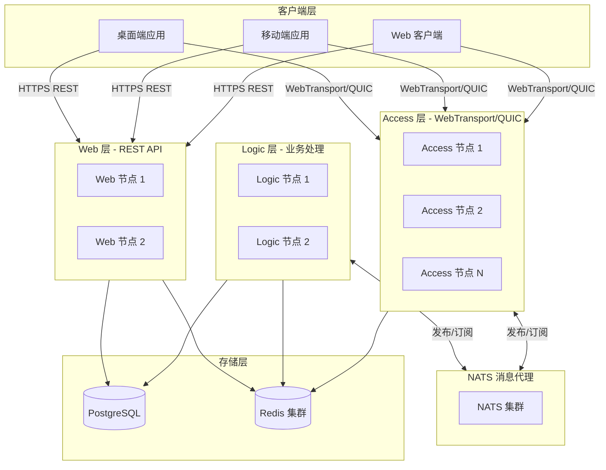
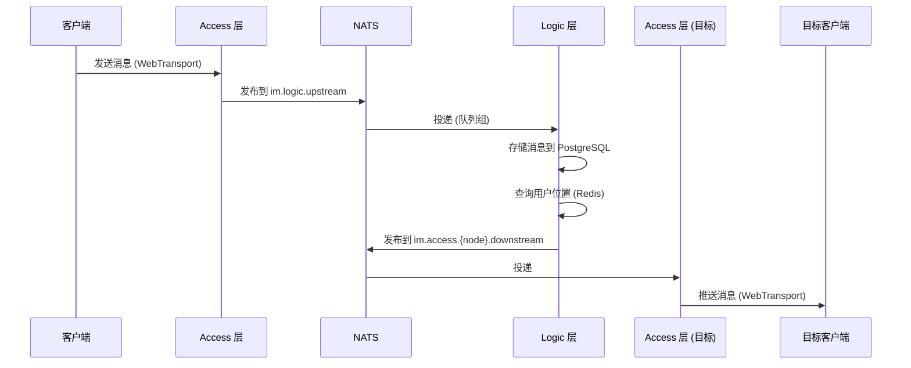

# IM-GO: 企业级即时通讯系统

> 基于 Go、React、WebTransport 和 QUIC 构建的高性能分布式即时通讯系统。

---

## 目录

- [项目概述](#项目概述)
- [系统架构](#系统架构)
- [技术栈](#技术栈)
- [模块说明](#模块说明)
- [项目结构](#项目结构)
- [核心特性](#核心特性)
- [开发规范](#开发规范)
- [快速开始](#快速开始)
- [API 文档](#api-文档)

---

## 项目概述

**IM-GO** 是一个为高并发和低延迟设计的分布式即时通讯系统。系统由四个主要模块组成，共同提供完整的 IM 解决方案：

1. **Access 层（接入层）** - 通过 WebTransport/QUIC 管理客户端长连接
2. **Logic 层（逻辑层）** - 处理核心 IM 业务逻辑（消息路由、存储等）
3. **Web 层（REST API 层）** - 提供用户管理、认证和好友操作的 REST API
4. **Desktop Web 客户端** - 基于 React 的终端用户 Web 应用

### 核心设计原则

- **微服务架构**：通过 NATS 通信的解耦模块
- **高性能**：基于 QUIC 协议，支持零 RTT 重连和多路复用
- **横向扩展**：无状态服务 + Redis 共享状态
- **非阻塞操作**：Access/Logic/Web 层的消息处理不得阻塞
- **二进制协议**：使用 FlatBuffers 高效序列化
- **事件驱动**：NATS 发布/订阅模式实现异步通信

---

## 系统架构

### 架构图



### 消息流转



---

## 技术栈

### 后端 (Go 1.25+)

#### Access 层
- **语言**: Go 1.25
- **协议**: WebTransport, QUIC (quic-go)
- **序列化**: FlatBuffers
- **消息代理**: NATS (nats.go)
- **缓存**: Redis (go-redis/v9)

#### Logic 层
- **语言**: Go 1.25
- **数据库**: PostgreSQL (pgx/v5)
- **缓存**: Redis (go-redis/v9)
- **消息代理**: NATS (nats.go)
- **配置管理**: Viper
- **日志**: log/slog

#### Web 层
- **框架**: Gin
- **认证**: JWT (golang-jwt/jwt/v5)
- **数据库**: PostgreSQL (pgx/v5)
- **缓存**: Redis (go-redis/v9)
- **密码加密**: bcrypt
- **API 文档**: Swagger (swaggo)

### 前端

#### Desktop Web 客户端
- **框架**: React 19.2.3
- **语言**: TypeScript 5.9.3
- **构建工具**: Vite 7.3.0
- **UI 库**: Ant Design 6.1.0
- **状态管理**: Zustand 5.0.9
- **路由**: React Router DOM 7.10.1
- **日期库**: Day.js 1.11.19
- **协议**: FlatBuffers 25.9.23
- **本地存储**: IndexedDB (idb 8.0.3)

### 基础设施

- **消息代理**: NATS 集群
- **数据库**: PostgreSQL（主从复制）
- **缓存**: Redis 集群
- **负载均衡**: Nginx / SLB

---

## 模块说明

### 1. Access 层 (`project/access-go`)

**用途**: 维护与客户端的 WebTransport/QUIC 长连接。

**核心职责**:
- 连接生命周期管理（建立、维护、关闭）
- QUIC/WebTransport 协议处理
- FlatBuffers 消息编解码
- 用户认证和会话绑定
- 消息路由（上行到 Logic，下行到客户端）
- 心跳机制
- 用户位置在 Redis 中的注册

**技术栈**:
- Go + quic-go + webtransport-go
- NATS 用于上下行消息
- Redis 用于用户位置存储

**NATS 主题**:
- 订阅: `im.access.{node_id}.downstream` (接收推送给客户端的消息)
- 发布: `im.logic.upstream` (发送客户端消息到 Logic)

**模块名**: `sudooom.im.access`

---

### 2. Logic 层 (`project/logic-go`)

**用途**: 处理核心 IM 业务逻辑。

**核心职责**:
- 消息处理和存储（PostgreSQL）
- 基于用户位置的消息路由（Redis 查询）
- 群消息扩散
- 会话管理（Redis）
- 离线消息处理
- 消息确认跟踪
- 用户上下线事件处理

**技术栈**:
- Go + NATS + PostgreSQL + Redis
- 消息批量写入优化
- 基于 goroutine 的非阻塞处理

**NATS 主题**:
- 订阅: `im.logic.upstream` (队列组: `logic-group`) - 接收来自 Access 的消息
- 发布: `im.access.{node_id}.downstream` - 发送消息到特定 Access 节点

**模块名**: `sudooom.im.logic`

---

### 3. Web 层 (`project/web-go`)

**用途**: 提供用户管理和认证的 REST API。

**核心职责**:
- 用户注册和登录
- JWT 令牌签发和验证
- 用户资料管理
- 好友请求和管理
- 令牌刷新机制
- API 限流

**技术栈**:
- Gin + JWT + PostgreSQL + Redis
- bcrypt 密码哈希
- Redis 令牌存储和缓存

**核心接口**:
- `POST /api/v1/auth/register` - 用户注册
- `POST /api/v1/auth/login` - 用户登录
- `POST /api/v1/auth/refresh` - 刷新访问令牌
- `GET /api/v1/user/profile` - 获取用户资料
- `POST /api/v1/friends/request` - 发送好友请求
- `GET /api/v1/friends` - 获取好友列表

**模块名**: `sudooom.im.web`

---

### 4. Desktop Web 客户端 (`project/desktop-web`)

**用途**: 基于 Web 的 IM 客户端应用。

**核心功能**:
- 用户认证（登录/注册）
- 通过 WebTransport 实现实时消息
- 好友管理
- 会话列表
- 消息历史记录与本地缓存（IndexedDB）
- 使用 Ant Design 的响应式 UI

**技术栈**:
- React + TypeScript + Vite
- WebTransport 持久化连接
- FlatBuffers 消息协议
- Zustand 状态管理
- IndexedDB 本地消息存储

---

### 5. Shared 模块 (`project/shared`)

**用途**: 跨服务共享的 Go 代码。

**内容**:
- JWT 工具
- 协议定义（Protobuf/FlatBuffers）
- Redis 键管理（`redis/keys.go`）
- 雪花 ID 生成器
- 通用模型

**模块名**: `sudooom.im.shared`

---

## 项目结构

```
im-go/
├── .agent/
│   └── rules/
│       └── im.md                    # AI 代理规则和项目指南
├── docs/
│   ├── access-layer-architecture.md # Access 层设计文档
│   ├── logic-layer-architecture.md  # Logic 层设计文档
│   └── web-layer-architecture.md    # Web 层设计文档
├── env/                             # 环境配置文件
├── project/
│   ├── access-go/                   # Access 层
│   │   ├── cmd/access/main.go
│   │   ├── internal/
│   │   │   ├── config/
│   │   │   ├── connection/
│   │   │   ├── nats/
│   │   │   ├── protocol/
│   │   │   ├── redis/
│   │   │   └── server/
│   │   ├── pkg/flatbuf/
│   │   └── configs/config.yaml
│   ├── logic-go/                    # Logic 层
│   │   ├── cmd/logic/main.go
│   │   ├── internal/
│   │   │   ├── config/
│   │   │   ├── handler/
│   │   │   ├── model/
│   │   │   ├── nats/
│   │   │   ├── repository/
│   │   │   └── service/
│   │   └── configs/config.yaml
│   ├── web-go/                      # Web 层
│   │   ├── cmd/web/main.go
│   │   ├── internal/
│   │   │   ├── config/
│   │   │   ├── handler/
│   │   │   ├── middleware/
│   │   │   ├── model/
│   │   │   ├── repository/
│   │   │   ├── service/
│   │   │   ├── router/
│   │   │   └── jwt/
│   │   ├── pkg/
│   │   │   ├── response/
│   │   │   └── validator/
│   │   └── configs/config.yaml
│   ├── desktop-web/                 # 前端客户端
│   │   ├── src/
│   │   │   ├── components/
│   │   │   ├── pages/
│   │   │   ├── protocol/            # FlatBuffers 生成代码
│   │   │   ├── stores/
│   │   │   └── App.tsx
│   │   ├── package.json
│   │   └── vite.config.ts
│   └── shared/                      # 共享 Go 代码
│       ├── jwt/
│       ├── proto/
│       ├── redis/
│       │   └── keys.go
│       └── snowflake/
├── schema/
│   ├── message.fbs                  # FlatBuffers 协议定义
│   ├── generate.sh
│   ├── generate-go.sh
│   └── generate-ts.sh
├── scripts/
│   ├── check-go-quality.sh          # Go 代码质量检查
│   └── ...
├── go.work                          # Go 工作区文件
└── CLAUDE.md                        # 本文件
```

---

## 核心特性

### 连接管理
- **QUIC 协议**: 零 RTT 重连，支持连接迁移
- **WebTransport**: 浏览器原生支持，具备降级兼容性
- **多端登录**: 支持跨多设备同时连接
- **心跳机制**: 30 秒间隔，90 秒超时（3 次心跳未响应）
- **优雅关闭**: 正确的连接清理和消息投递保证

### 消息投递
- **至少一次投递**: 消息 ACK 机制与重试
- **离线消息**: 接收者离线时存储消息
- **消息顺序**: 按会话的消息序列号
- **已读回执**: 会话已读状态跟踪

### 性能优化
- **消息批量写入**: 批量写入 PostgreSQL 提高吞吐量
- **连接池**: 高效的数据库和 Redis 连接管理
- **Goroutine 池**: 通过工作池控制并发
- **缓存策略**: Redis 缓存热点数据（用户信息、好友列表、会话）

### 安全性
- **JWT 认证**: 7 天访问令牌，30 天刷新令牌
- **bcrypt 密码哈希**: 成本因子 10
- **HTTPS/TLS**: 所有连接加密
- **令牌黑名单**: 基于 Redis 的令牌撤销
- **限流**: 基于 IP 的请求限流

### 可扩展性
- **横向扩展**: 无状态服务 + Redis 共享状态
- **负载均衡**: NATS 队列组实现 Logic 层分发
- **数据库复制**: PostgreSQL 主从架构
- **Redis 集群**: 分布式缓存和状态管理

---

## 开发规范

### 数据库规范

1. **表结构要求**:
   - 每张表必须包含: `id`（雪花 ID）、`created_at`、`updated_at`、`deleted` 字段
   - `created_at`、`updated_at`: 时间戳字段，对应创建时间和修改时间
   - `deleted`: 逻辑删除字段（0 = 正常，1 = 已删除）
   - **绝对禁止外键**: 可在字段注释中说明关系，但绝不使用数据库外键

2. **字段要求**:
   - 每个字段必须有注释描述其用途
   - 字符串字段必须设置为 NOT NULL，默认值为空字符串（`DEFAULT ''`）
   - 使用 `column != ''` 检查空字符串，不要使用 `column = NULL`

3. **Schema 同步**:
   - 修改 `schema.sql` 时，必须更新对应的 model
   - 修改 model 时，必须更新 `schema.sql`
   - 新增 model = 在 schema 中新增表；新增表 = 生成对应的 model

### Go 代码规范

1. **非阻塞要求**:
   - 在 Access/Logic/Web 模块中，消息处理绝对不能阻塞
   - 使用 goroutine 和 channel 进行异步处理
   - 只记录错误日志；绝不在错误处理中阻塞

2. **Redis 键管理**:
   - 所有 Redis 键操作必须在 `shared/redis/keys.go` 中定义
   - 绝不在应用代码中硬编码 Redis 键

3. **JSON 字段命名**:
   - 后端返回的 JSON 字段必须使用驼峰命名格式（camelCase）
   - 返回给前端的 ID 字段必须是字符串类型（JavaScript 精度问题）

4. **代码质量**:
   - 修改 Go 代码后运行 `scripts/check-go-quality.sh`
   - 提交前修复所有错误和警告
   - 版本控制中不得包含编译产物

5. **文件清理**:
   - 提交前删除所有 `.bak` 备份文件

6. **错误处理**:
   - 使用 `errors.Is()` 和 `errors.As()` 进行错误判断
   - 不要忽略错误，至少要记录日志
   - 关键路径的错误必须包含上下文信息

7. **并发安全**:
   - 共享数据必须使用互斥锁或 channel 保护
   - 避免在 goroutine 中直接使用闭包变量
   - 使用 `context.Context` 传递取消信号

8. **资源管理**:
   - 使用 `defer` 确保资源释放
   - 数据库连接、文件句柄等必须正确关闭
   - HTTP 响应体必须关闭

9. **命名规范**:
   - 导出的函数和类型使用大写字母开头
   - 私有的函数和类型使用小写字母开头
   - 接口名称通常以 `er` 结尾（如 `Reader`、`Writer`）
   - 避免使用下划线分隔，使用驼峰命名

10. **日志规范**:
    - 使用结构化日志（slog）
    - 日志级别：Debug、Info、Warn、Error
    - 包含必要的上下文信息（userId、requestId 等）

### React/TypeScript 前端规范

1. **协议同步**:
   - 当 `schema/message.fbs` 修改后，运行 `npm run flatc` 重新生成 TypeScript 代码

2. **代码质量**:
   - 修改 desktop-web 代码后运行 `scripts/check-web-quality.sh`
   - 提交前修复所有错误和警告
   - 版本控制中不得包含编译产物和构建文件

3. **类型安全**:
   - 使用 TypeScript 严格模式
   - 不得使用 `any` 类型，除非有充分理由
   - 优先使用类型推断

4. **组件规范**:
   - 使用函数组件和 Hooks
   - 组件文件名使用 PascalCase（如 `UserProfile.tsx`）
   - 每个组件一个文件
   - 复杂组件拆分为更小的子组件

5. **状态管理**:
   - 使用 Zustand 管理全局状态
   - 局部状态使用 `useState` 和 `useReducer`
   - 避免 prop drilling，使用 Context 或状态管理

6. **性能优化**:
   - 使用 `React.memo` 避免不必要的重渲染
   - 使用 `useMemo` 和 `useCallback` 缓存计算和函数
   - 列表渲染必须使用稳定的 `key`

7. **代码风格**:
   - 使用 ESLint 和 Prettier 格式化代码
   - 使用解构赋值
   - 避免嵌套三元表达式
   - 函数保持简洁，单一职责

8. **异步处理**:
   - 使用 `async/await` 处理异步操作
   - 正确处理 Loading 和 Error 状态
   - 使用 try-catch 捕获异常

9. **样式规范**:
   - 使用 Ant Design 组件库
   - 自定义样式使用 CSS Modules 或 styled-components
   - 避免内联样式

10. **测试规范**:
   - 关键组件编写单元测试
   - 使用 React Testing Library
   - Mock 外部依赖

11. **目录结构**:
    ```
    src/
    ├── components/      # 通用组件
    ├── pages/          # 页面组件
    ├── stores/         # Zustand 状态
    ├── hooks/          # 自定义 Hooks
    ├── services/       # API 服务
    ├── utils/          # 工具函数
    ├── types/          # TypeScript 类型定义
    └── constants/      # 常量定义
    ```

### Git 提交规范

1. **提交信息格式**:
   ```
   <type>(<scope>): <subject>

   <body>

   <footer>
   ```

2. **Type 类型**:
   - `feat`: 新功能
   - `fix`: 修复 Bug
   - `docs`: 文档更新
   - `style`: 代码格式（不影响代码运行）
   - `refactor`: 重构（既不是新增功能，也不是修复 Bug）
   - `perf`: 性能优化
   - `test`: 测试相关
   - `chore`: 构建过程或辅助工具的变动

3. **示例**:
   ```
   feat(access): 添加 WebTransport 连接支持

   - 实现 QUIC 连接处理
   - 添加心跳机制
   - 支持多端登录

   Closes #123
   ```

---

## 快速开始

### 环境要求

- Go 1.25+
- Node.js 18+
- PostgreSQL 14+
- Redis 6+
- NATS Server 2.9+

### 启动步骤

#### 1. 克隆仓库

```bash
git clone <repository-url>
cd im-go
```

#### 2. 启动基础设施服务

```bash
# 启动 PostgreSQL
docker run -d -p 5432:5432 \
  -e POSTGRES_PASSWORD=postgres \
  -e POSTGRES_DB=im \
  postgres:14

# 启动 Redis
docker run -d -p 6379:6379 redis:6

# 启动 NATS
docker run -d -p 4222:4222 nats:latest
```

#### 3. 初始化数据库

```bash
# 运行迁移（创建表）
psql -h localhost -U postgres -d im -f schema/schema.sql
```

#### 4. 配置服务

编辑各模块的配置文件：
- `project/access-go/configs/config.yaml`
- `project/logic-go/configs/config.yaml`
- `project/web-go/configs/config.yaml`

#### 5. 生成协议代码

```bash
cd schema
./generate.sh  # 从 FlatBuffers schema 生成 Go 和 TypeScript 代码
```

#### 6. 启动后端服务

```bash
# 终端 1: 启动 Web 层
cd project/web-go
go run cmd/web/main.go

# 终端 2: 启动 Logic 层
cd project/logic-go
go run cmd/logic/main.go

# 终端 3: 启动 Access 层
cd project/access-go
go run cmd/access/main.go
```

#### 7. 启动前端客户端

```bash
cd project/desktop-web
npm install
npm run dev
```

Web 客户端将在 `http://localhost:5173` 上运行

---

## API 文档

### 认证相关

#### 注册
```http
POST /api/v1/auth/register
Content-Type: application/json

{
  "username": "johndoe",
  "password": "Password123!",
  "nickname": "John Doe",
  "phone": "13800138000",
  "email": "john@example.com"
}
```

#### 登录
```http
POST /api/v1/auth/login
Content-Type: application/json

{
  "username": "johndoe",
  "password": "Password123!",
  "device_id": "device-uuid",
  "platform": "web"
}

响应:
{
  "code": 0,
  "message": "success",
  "data": {
    "user_id": "1234567890",
    "access_token": "eyJhbGc...",
    "refresh_token": "eyJhbGc...",
    "expires_at": 1672531200
  }
}
```

### 好友管理

#### 发送好友请求
```http
POST /api/v1/friends/request
Authorization: Bearer <access_token>
Content-Type: application/json

{
  "friend_id": "9876543210",
  "message": "你好，我们交个朋友吧！"
}
```

#### 获取好友列表
```http
GET /api/v1/friends
Authorization: Bearer <access_token>

响应:
{
  "code": 0,
  "message": "success",
  "data": [
    {
      "id": "1",
      "userId": "1234567890",
      "friendId": "9876543210",
      "remark": "好友",
      "createdAt": "2024-01-01T00:00:00Z"
    }
  ]
}
```

完整的 API 文档请访问 Web 层运行时的 Swagger UI：`http://localhost:8080/swagger/index.html`

---

## NATS 消息流

### 主题设计

| 主题 | 方向 | 用途 | 订阅类型 |
|------|------|------|---------|
| `im.logic.upstream` | Access → Logic | 客户端消息到 Logic | QueueSubscribe (logic-group) |
| `im.access.{node_id}.downstream` | Logic → Access | 消息到特定 Access 节点 | Subscribe |
| `im.access.broadcast` | Logic → All Access | 广播消息 | Subscribe |
| `im.user.{user_id}.event` | 双向 | 用户级别事件 | Subscribe |

### 消息类型（FlatBuffers）

完整协议定义请参考 `schema/message.fbs`。

**上行消息**（客户端 → Access → Logic）:
- `UserMessage`: 聊天消息
- `UserOnline`: 用户上线事件
- `UserOffline`: 用户下线事件
- `ConversationRead`: 标记会话已读

**下行消息**（Logic → Access → 客户端）:
- `PushMessage`: 推送消息给客户端
- `MessageAck`: 确认消息接收
- `SystemNotification`: 系统通知

---

## 部署

### 生产环境考虑

1. **高可用性**:
   - 在多个可用区部署 Access/Logic/Web 服务
   - 使用 NATS 集群（3+ 节点）实现消息代理高可用
   - PostgreSQL 主从架构，支持自动故障转移
   - Redis 集群（至少 3 主 3 从）

2. **容量规划**:
   - 单个 Access 节点：约 5 万并发连接（4 核 CPU，8GB 内存）
   - 100 万连接：部署 20+ Access 节点
   - Logic 层：根据消息吞吐量扩展
   - Web 层：根据 HTTP 请求负载扩展

3. **监控**:
   - Prometheus + Grafana 监控指标
   - ELK 堆栈集中日志管理
   - 告警：连接数激增、消息延迟、数据库查询性能

4. **安全性**:
   - 使用防火墙规则限制服务通信
   - 定期轮换 JWT 密钥
   - 启用 PostgreSQL SSL 连接
   - 使用 Redis AUTH 认证

---

## 性能指标

### 目标基准

- **连接建立时间**: < 100ms（使用 0-RTT）
- **消息投递延迟**: < 50ms（P99）
- **消息吞吐量**: > 10 万消息/秒（每个 Logic 节点）
- **并发连接数**: 每个 Access 节点 5 万
- **API 响应时间**: < 100ms（P95）

---

## 贡献指南

为项目贡献代码时：

1. 遵循本文档中的开发规范
2. 提交 Go 代码前运行 `scripts/check-go-quality.sh`
3. 确保所有测试通过
4. 更新任何 API 或协议变更的文档
5. 使用规范的提交信息

---

## 许可证

[待定]

---

## 技术支持

如有问题或需要帮助：
- **文档**: 查看 `docs/` 目录获取详细架构文档
- **Issues**: [GitHub Issues](your-repo-url)
- **讨论**: [GitHub Discussions](your-repo-url)

---

**Generated with Claude Code** - 最后更新: 2026-01-12