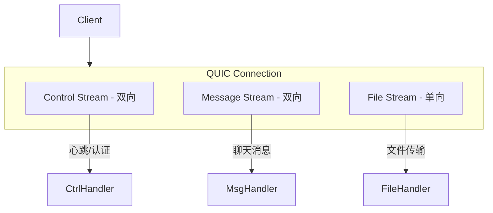
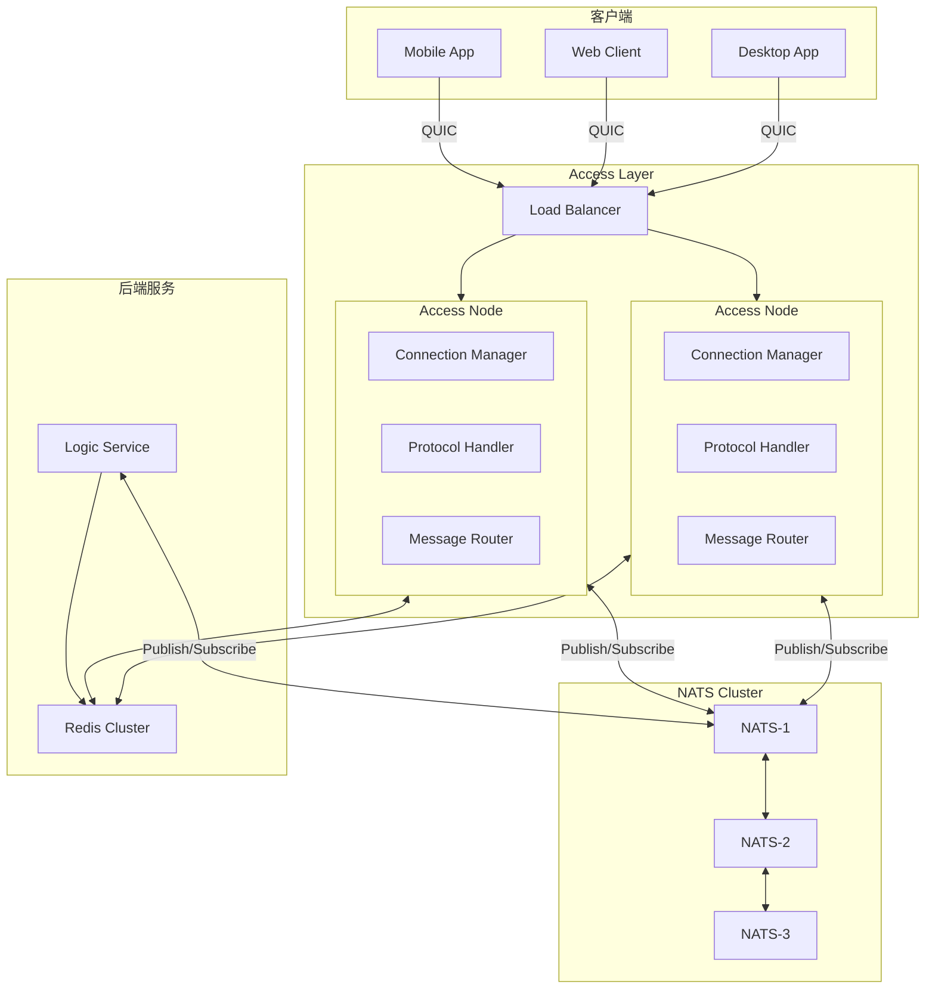
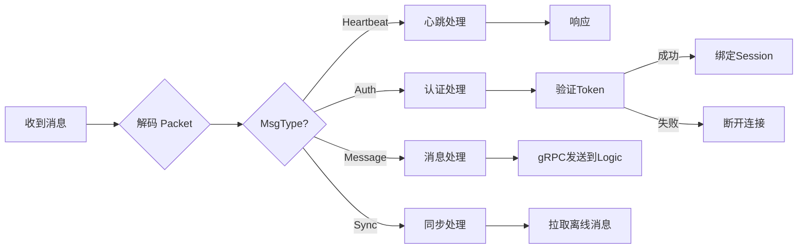
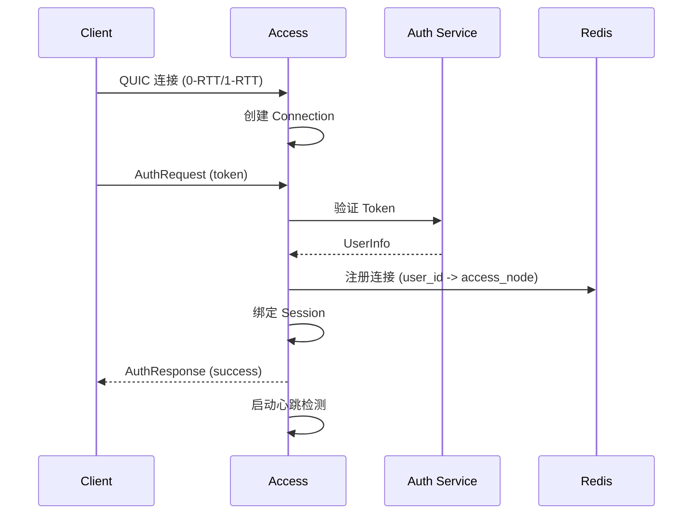
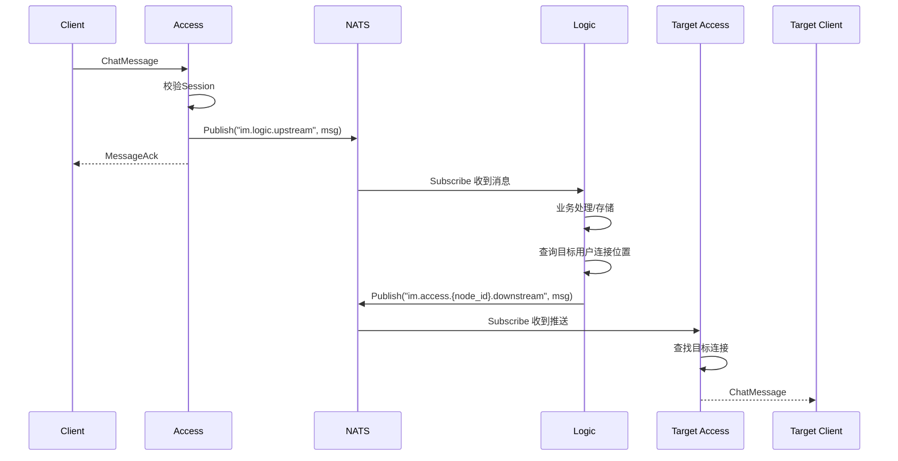
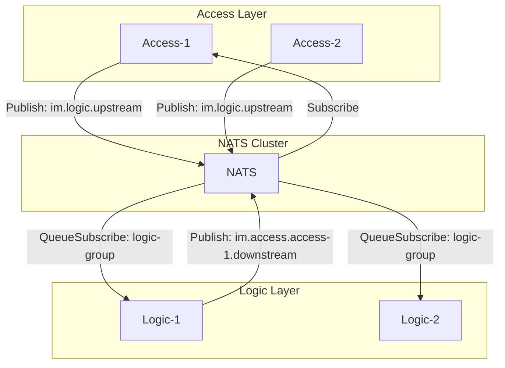
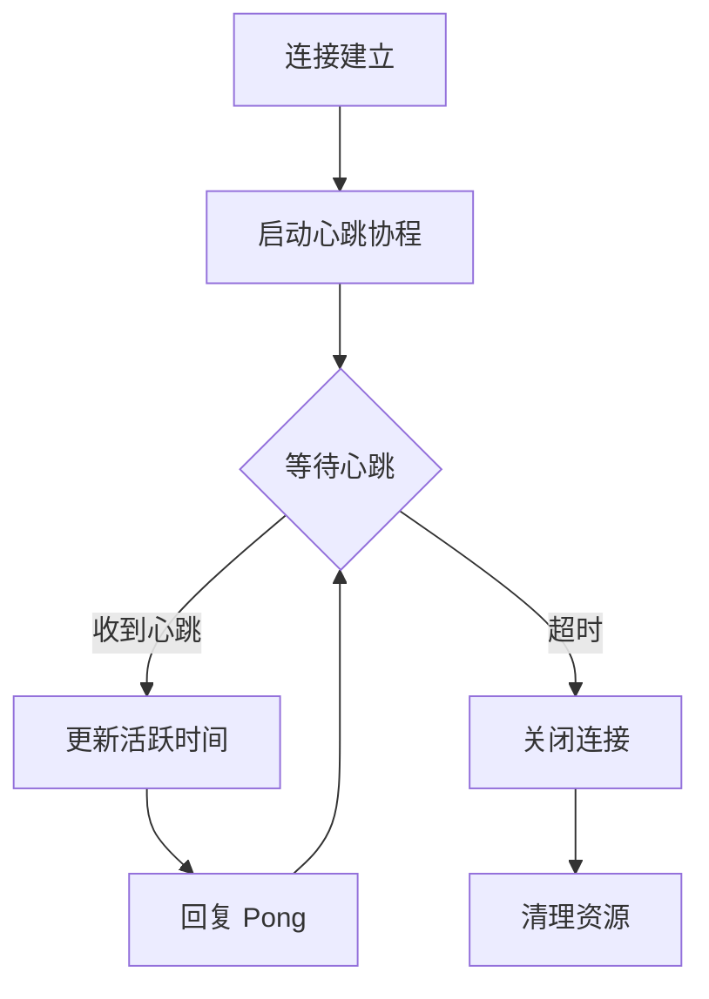
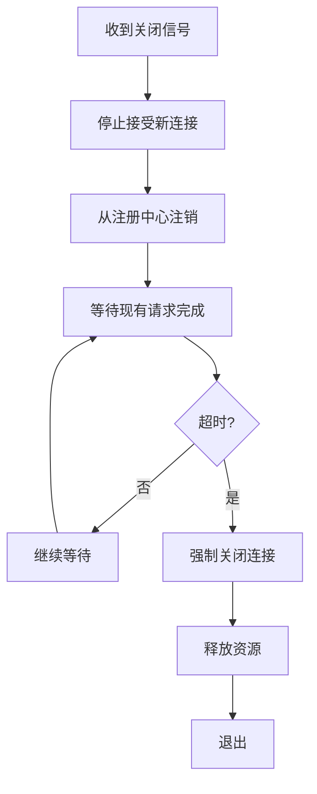
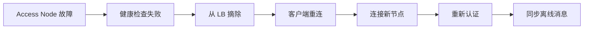
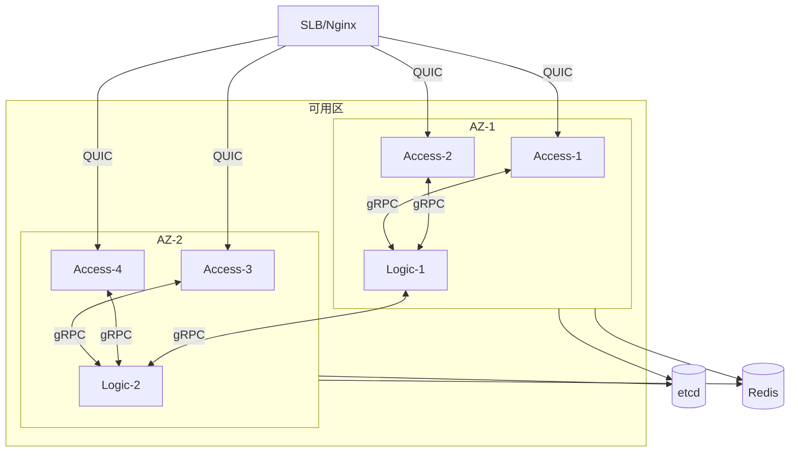

# IM Access Layer 架构设计

基于 Go + FlatBuffers 的即时通讯系统接入层架构设计文档。

---

## 1. 系统概述

Access Layer（接入层）是 IM 系统的网关层，负责处理客户端连接、协议解析、消息路由等核心功能。

### 1.1 核心职责

| 职责 | 描述 |
|------|------|
| 连接管理 | 长连接维护、心跳检测、优雅断开 |
| 协议处理 | FlatBuffers 序列化/反序列化 |
| 认证鉴权 | Token 校验、会话管理 |
| 消息路由 | 上行消息转发、下行消息推送 |
| 负载均衡 | 连接分片、流量控制 |

### 1.2 技术选型

```
┌─────────────────────────────────────────────────────────┐
│                    技术栈                                │
├─────────────────┬───────────────────────────────────────┤
│ 语言            │ Go 1.25                               │
│ 序列化协议      │ FlatBuffers                           │
│ 客户端传输      │ WebTransport (quic-go) + QUIC         │
│ 内部通信        │ NATS (nats.go)                        │
│ 用户位置存储    │ Redis                                 │
└─────────────────┴───────────────────────────────────────┘
```

> [!TIP]
> **为什么选择 WebTransport**：基于 QUIC 协议，支持浏览器原生访问，同时兼容非浏览器客户端。

### 1.3 为什么选择 QUIC

| 特性 | 优势 |
|------|------|
| 0-RTT 握手 | 首次连接 1-RTT，重连 0-RTT，降低延迟 |
| 多路复用 | 单连接多 Stream，无队头阻塞 |
| 连接迁移 | 网络切换（WiFi↔4G）无需重连 |
| 内置加密 | 强制 TLS 1.3，安全性更高 |
| 拥塞控制 | 可插拔算法，优于 TCP |

### 1.4 QUIC (quic-go) 设计要点

#### 连接与 Stream 模型



#### Stream 分配策略

| Stream 类型 | 用途 | 生命周期 |
|-------------|------|----------|
| Control Stream | 心跳、认证、同步 | 与连接同生命周期 |
| Message Stream | 聊天消息收发 | 长期复用 |
| Ephemeral Stream | 大文件/媒体传输 | 临时创建，传完关闭 |

#### quic-go 关键配置

```go
// TLS 配置
tlsConfig := &tls.Config{
    Certificates: []tls.Certificate{cert},
    NextProtos:   []string{"im-access"},  // ALPN
    MinVersion:   tls.VersionTLS13,
}

// QUIC 配置
quicConfig := &quic.Config{
    MaxIdleTimeout:        90 * time.Second,
    KeepAlivePeriod:       30 * time.Second,
    MaxIncomingStreams:    100,
    MaxIncomingUniStreams: 50,
    Allow0RTT:             true,  // 启用 0-RTT
    EnableDatagrams:       true,  // 启用 Datagram (可选)
}

// 启动服务
listener, err := quic.ListenAddr(":8443", tlsConfig, quicConfig)
```

#### 0-RTT 安全考虑

> [!WARNING]
> 0-RTT 数据可被重放，需确保幂等性或使用 anti-replay 机制

- 认证消息：禁止 0-RTT
- 心跳/只读查询：允许 0-RTT
- 发送消息：需服务端去重 (MsgID)

---

## 2. 整体架构



---

## 3. 模块设计

### 3.1 项目目录结构

```
access-go/
├── cmd/
│   └── access/
│       └── main.go              # 入口
├── internal/
│   ├── config/
│   │   └── config.go            # 配置加载
│   ├── connection/
│   │   ├── connection.go        # 连接抽象
│   │   ├── manager.go           # 连接管理器
│   │   └── session.go           # 会话状态
│   ├── nats/
│   │   └── subscriber.go        # NATS 订阅器
│   ├── protocol/
│   │   └── dispatcher.go        # 消息分发
│   ├── redis/
│   │   └── user_location.go     # 用户位置管理
│   └── server/
│       ├── quic.go              # QUIC 服务器
│       └── webtransport.go      # WebTransport 服务器
├── pkg/
│   └── flatbuf/                 # FlatBuffers 生成代码
├── schema/
│   └── message.fbs              # FlatBuffers Schema
├── configs/
│   └── config.yaml
├── go.mod
└── go.sum
```

> [!IMPORTANT]
> **用户位置管理**：Access 层直接管理用户连接位置，存储在 Redis 中。Logic 层仅读取位置信息进行消息路由。

### 3.2 核心模块详解

#### 3.2.1 连接管理器 (Connection Manager)

```mermaid
classDiagram
    class ConnectionManager {
        -connections map[int64]*Connection
        -rwMutex sync.RWMutex
        +Add(conn *Connection)
        +Remove(connID int64)
        +Get(connID int64) *Connection
        +GetByUserID(userID int64) []*Connection
        +Broadcast(msg []byte)
        +Count() int
    }

    class Connection {
        -id int64
        -userID int64
        -quicConn quic.Connection
        -stream quic.Stream
        -session *Session
        -writeChan chan []byte
        -closeChan chan struct{}
        +Read() error
        +Write(data []byte) error
        +Close()
    }

    class Session {
        -userID int64
        -deviceID string
        -platform string
        -loginTime time.Time
        -lastActiveTime time.Time
        +UpdateActive()
        +IsExpired() bool
    }

    ConnectionManager "1" --> "*" Connection
    Connection "1" --> "1" Session
```

#### 3.2.2 协议层 (Protocol Layer)

**消息帧格式：**

```
┌────────────┬────────────┬──────────────────────────┐
│  Length    │  MsgType   │      FlatBuffer Body     │
│  (4 bytes) │  (2 bytes) │      (Variable)          │
└────────────┴────────────┴──────────────────────────┘
```

**FlatBuffers Schema 示例：**

```fbs
// schema/message.fbs
namespace im.protocol;

enum MsgType : short {
    Heartbeat = 0,
    Auth = 1,
    AuthAck = 2,
    Message = 10,
    MessageAck = 11,
    Sync = 20,
    SyncAck = 21,
}

table Packet {
    seq: uint64;
    msg_type: MsgType;
    timestamp: uint64;
    payload: [ubyte];
}

table AuthRequest {
    token: string;
    device_id: string;
    platform: string;
}

table AuthResponse {
    code: int;
    user_id: int64;
    message: string;
}

table ChatMessage {
    msg_id: string;
    from_user: int64;
    to_user: int64;
    content: string;
    content_type: int;
    timestamp: uint64;
}

root_type Packet;
```

#### 3.2.3 消息分发器 (Dispatcher)



---

## 4. 核心流程

### 4.1 连接建立流程



### 4.2 消息发送流程



### 4.3 NATS Subject 设计

#### Subject 命名规范

| Subject | 方向 | 用途 |
|---------|------|------|
| `im.logic.upstream` | Access → Logic | 上行消息，队列组负载均衡 |
| `im.access.{node_id}.downstream` | Logic → Access | 下行推送，指定节点 |
| `im.access.broadcast` | Logic → All Access | 广播消息 |
| `im.user.{user_id}.event` | 双向 | 用户级别事件 |

#### 通信模型



#### Go 代码示例

```go
// Access 节点启动时
func (a *Access) Start() {
    nc, _ := nats.Connect("nats://localhost:4222")

    // 订阅自己的下行 Subject
    nodeID := a.GetNodeID()
    nc.Subscribe("im.access."+nodeID+".downstream", func(msg *nats.Msg) {
        // 处理下行推送
        a.handleDownstream(msg.Data)
    })
}

// 发送上行消息
func (a *Access) SendUpstream(msg *proto.UpstreamMessage) {
    data, _ := proto.Marshal(msg)
    a.nc.Publish("im.logic.upstream", data)
}
```

#### 连接管理策略

| 策略 | 说明 |
|------|------|
| 自动重连 | nats.go 内置，无需额外处理 |
| 负载均衡 | QueueSubscribe 自动分流 |
| 集群容错 | NATS 集群自动故障转移 |
| 心跳 | NATS 连接层心跳 |

### 4.4 心跳保活机制



**参数配置：**
- 心跳间隔：30s
- 超时时间：90s（3次心跳未响应）
- 重连策略：指数退避

---

## 5. 关键设计

### 5.1 连接路由表

使用 Redis 存储用户连接位置：

```
Key: im:user:conn:{user_id}
Value: {
    "access_node": "10.0.0.1:8080",
    "conn_id": 12345,
    "device_id": "xxx",
    "platform": "iOS",
    "login_time": 1702600000
}
TTL: 连接存在时续期
```

### 5.2 多端登录策略

```go
type MultiDevicePolicy int

const (
    SingleDevice     MultiDevicePolicy = iota // 单端登录，踢掉旧连接
    MultiDevice                               // 多端登录，共存
    SinglePerPlatform                         // 每个平台保留一个
)
```

### 5.3 优雅关闭



---

## 6. 高可用设计

### 6.1 无状态设计

- Access 节点本身无状态
- 连接路由信息存储在 Redis
- 支持水平扩展

### 6.2 故障转移



### 6.3 限流策略

| 层级 | 策略 |
|------|------|
| 连接数 | 单节点最大连接数限制 |
| 消息频率 | 令牌桶限流 (per user) |
| IP 限制 | 同 IP 连接数限制 |

---

## 7. 监控指标

### 7.1 关键指标

| 指标 | 描述 |
|------|------|
| `access_connections_total` | 当前活跃连接数 |
| `access_messages_received` | 收到消息数 |
| `access_messages_sent` | 发送消息数 |
| `access_auth_success` | 认证成功次数 |
| `access_auth_failed` | 认证失败次数 |
| `access_message_latency` | 消息处理延迟 |

### 7.2 告警规则

- 连接数突增 > 50%
- 认证失败率 > 10%
- 消息延迟 P99 > 100ms

---

## 8. 部署架构



---

## 9. 容量规划

### 9.1 单节点容量估算

| 资源 | 配置 | 支撑连接数 |
|------|------|-----------|
| CPU | 4 核 | 50K |
| 内存 | 8 GB | 50K |
| 带宽 | 1 Gbps | 50K |

> 假设每连接占用内存 ~100KB，消息吞吐 ~1KB/s

### 9.2 百万连接方案

- 20+ Access 节点
- 多 Logic 节点 (根据业务复杂度)
- Redis 集群 (3 主 3 从)
- 多可用区部署

---

## 10. 后续演进

- [x] 支持 QUIC 协议 (quic-go)
- [ ] 消息压缩 (LZ4/Snappy)
- [ ] 端到端加密 (E2EE)
- [ ] 边缘节点部署 (Edge Computing)
- [ ] 智能路由优化
- [ ] WebTransport 降级支持 (浏览器兼容)
