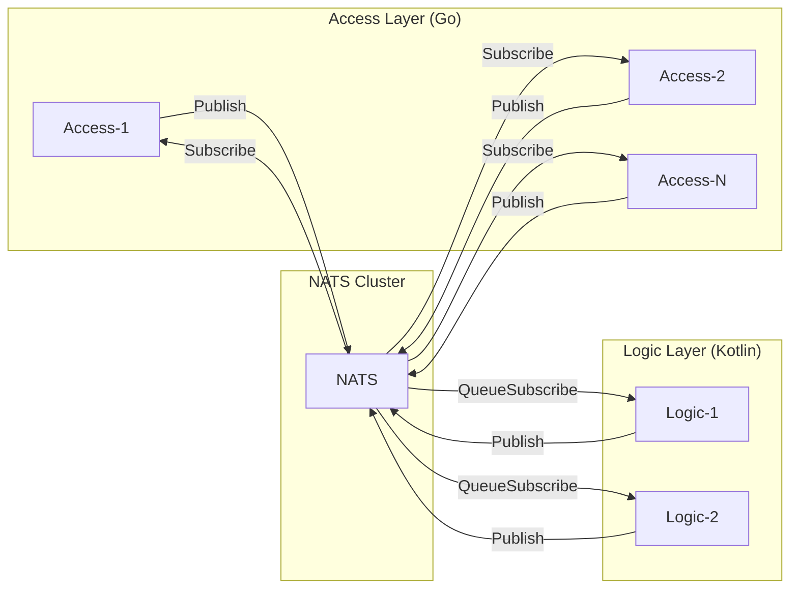
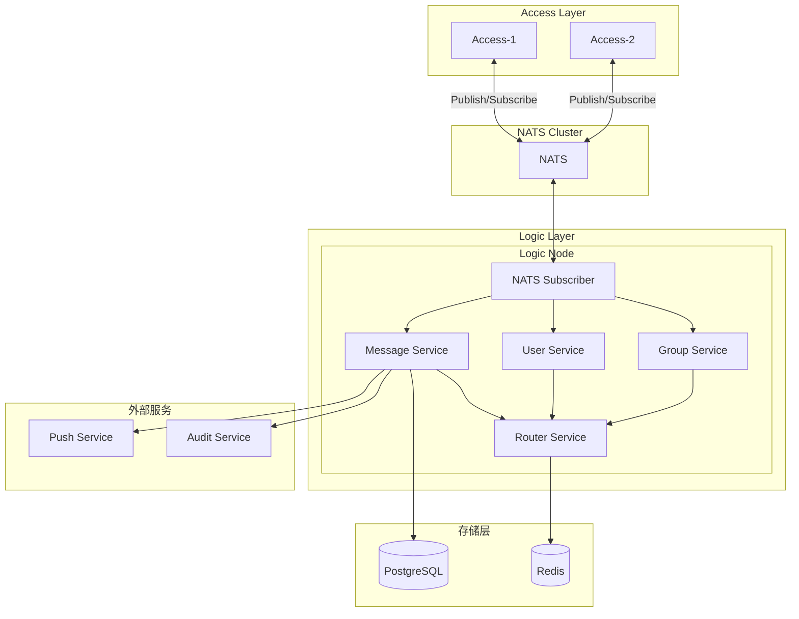
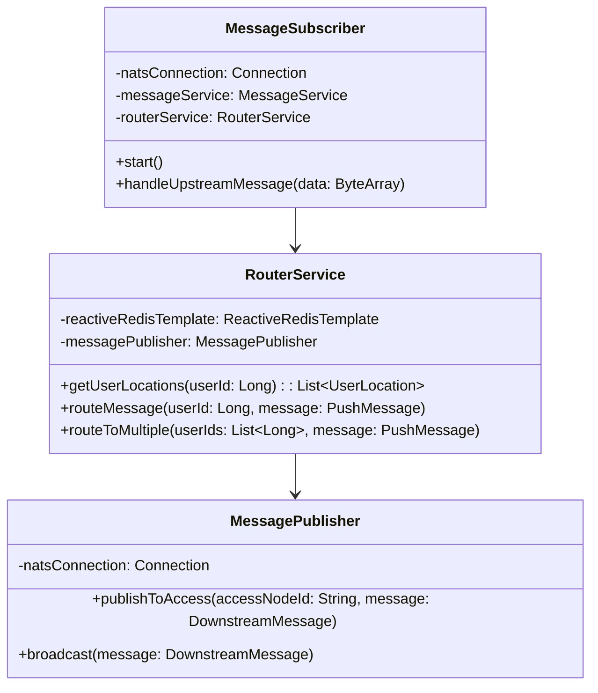
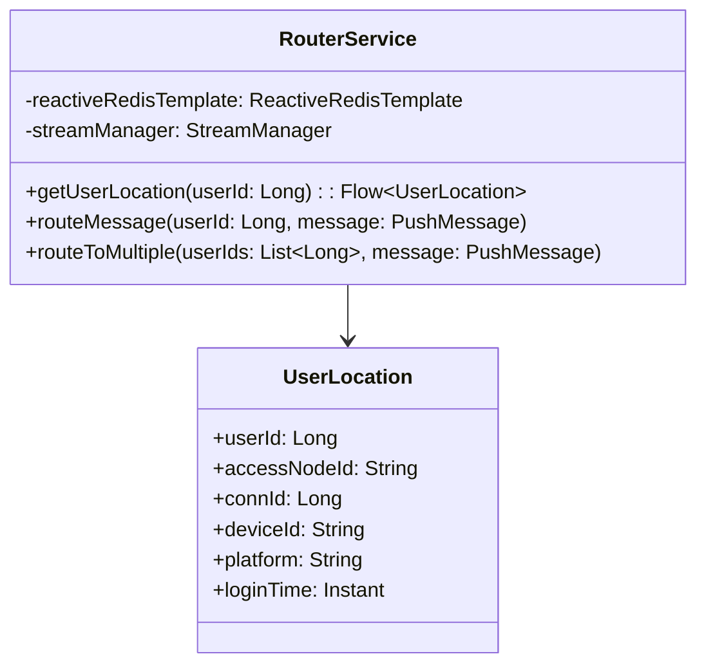
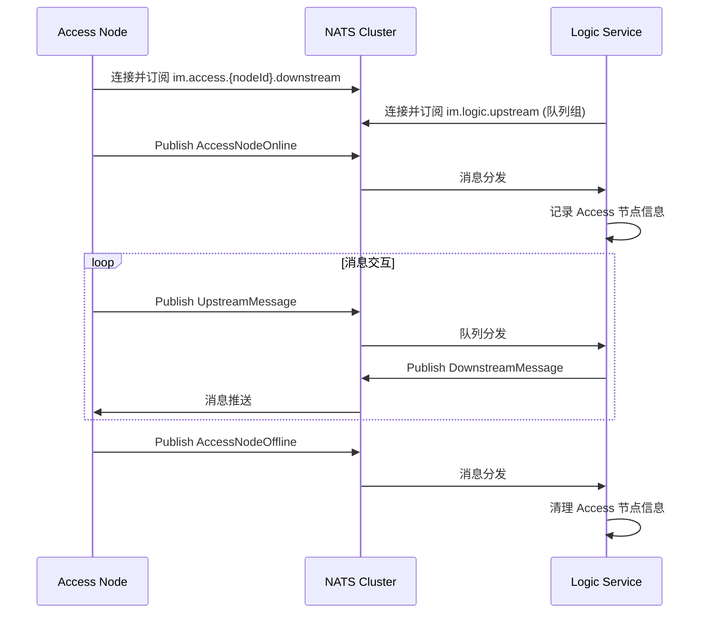
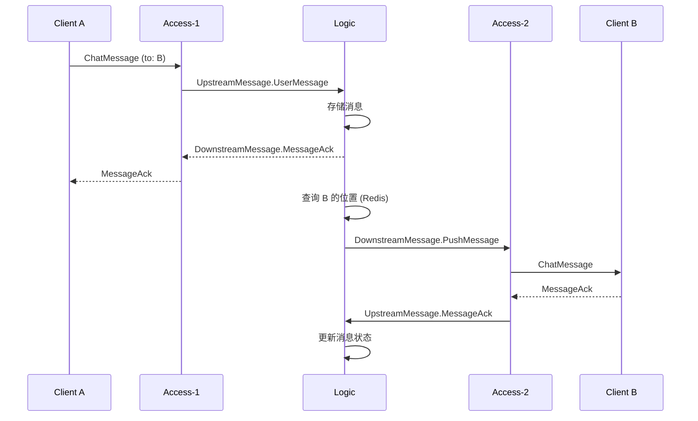
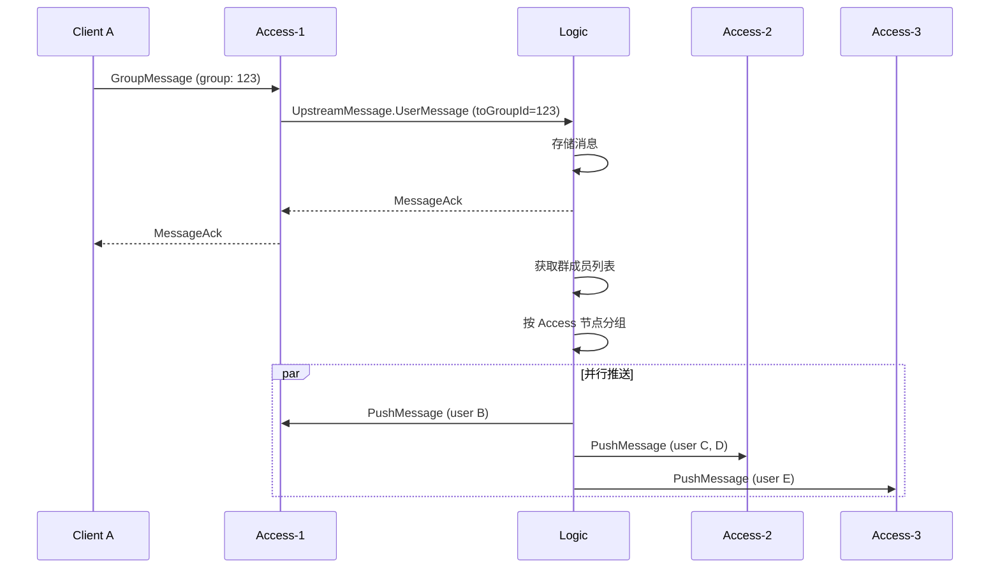
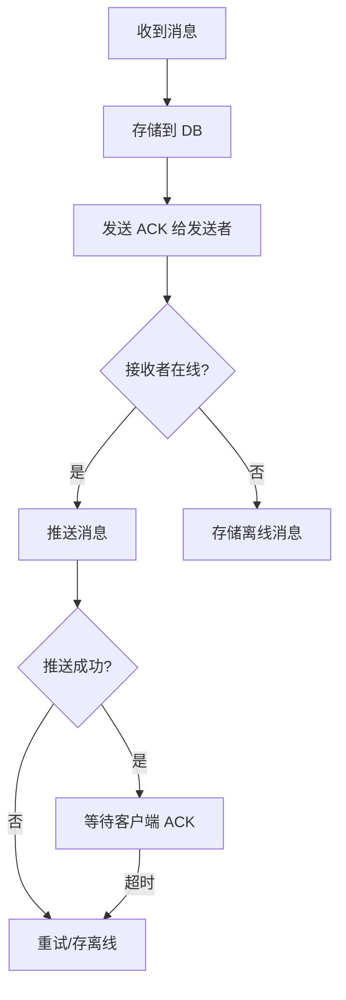

# IM Logic Layer 架构设计

基于 Kotlin + Spring Boot 的即时通讯系统逻辑层架构设计文档。

---

## 1. 系统概述

Logic Layer（逻辑层）是 IM 系统的业务核心，负责消息处理、用户管理、群组管理等核心业务逻辑。

### 1.1 核心职责

| 职责 | 描述 |
|------|------|
| 消息处理 | 消息存储、转发、离线消息管理 |
| 用户管理 | 用户状态、在线信息、多端同步 |
| 群组管理 | 群消息扩散、成员管理 |
| 消息路由 | 根据用户位置路由到正确的 Access 节点 |
| 业务逻辑 | 敏感词过滤、消息审核、已读回执 |

### 1.2 技术选型

```
┌─────────────────────────────────────────────────────────┐
│                    技术栈                                │
├─────────────────┬───────────────────────────────────────┤
│ 语言            │ Kotlin 2.2.0                          │
│ JDK             │ 21                                    │
│ 构建工具        │ Gradle 9.2.1 (Kotlin DSL)             │
│ 框架            │ Spring Boot 4.0.0 (无 Web/Servlet)    │
│ 内部通信        │ NATS (nats.java)                      │
│ 数据库          │ PostgreSQL                            │
│ ORM             │ Spring Data R2DBC (响应式)             │
│ 缓存            │ Spring Data Reactive Redis            │
│ 协程            │ Kotlin Coroutines + Flow              │
└─────────────────┴───────────────────────────────────────┘
```

> [!IMPORTANT]
> **无 Servlet/Jakarta EE 架构**：本服务不包含任何 HTTP 服务器，通过 NATS 与 Access 层通信。
> 所有 I/O 操作均为响应式/非阻塞，包括数据库 (R2DBC) 和 Redis (Reactive)。

### 1.3 与 Access 层通信



---

## 2. 整体架构



---

## 3. 模块设计

### 3.1 项目目录结构

```
im-logic/
├── build.gradle.kts
├── settings.gradle.kts
├── src/
│   ├── main/
│   │   ├── kotlin/
│   │   │   └── com/example/im/logic/
│   │   │       ├── ImLogicApplication.kt
│   │   │       ├── nats/
│   │   │       │   ├── NatsClient.kt              # NATS 客户端
│   │   │       │   ├── MessageSubscriber.kt       # 消息订阅器
│   │   │       │   └── MessagePublisher.kt        # 消息发布器
│   │   │       ├── service/
│   │   │       │   ├── MessageService.kt            # 消息业务
│   │   │       │   ├── UserService.kt               # 用户业务
│   │   │       │   ├── GroupService.kt              # 群组业务
│   │   │       │   └── RouterService.kt             # 路由服务
│   │   │       ├── repository/
│   │   │       │   ├── MessageRepository.kt
│   │   │       │   ├── UserRepository.kt
│   │   │       │   └── GroupRepository.kt
│   │   │       ├── entity/
│   │   │       │   ├── Message.kt
│   │   │       │   ├── User.kt
│   │   │       │   └── Group.kt
│   │   │       ├── config/
│   │   │       │   ├── NatsConfig.kt               # NATS 配置
│   │   │       │   └── RedisConfig.kt
│   │   │       └── util/
│   │   └── resources/
│   │       └── application.yml
│   └── test/
```

### 3.2 核心模块详解

#### 3.2.1 NATS 消息服务



#### 3.2.2 消息路由服务



---

## 5. 核心代码实现

### 5.1 NATS 订阅者实现

```kotlin
@Component
class MessageSubscriber(
    private val natsConnection: Connection,
    private val messageService: MessageService,
    private val userService: UserService,
    private val routerService: RouterService,
    private val objectMapper: ObjectMapper
) {
    private val logger = LoggerFactory.getLogger(javaClass)
    private val dispatcher: Dispatcher = natsConnection.createDispatcher()

    @PostConstruct
    fun start() {
        // 订阅上行消息 - 使用队列组实现负载均衡
        dispatcher.subscribe("im.logic.upstream", "logic-group") { msg ->
            CoroutineScope(Dispatchers.IO).launch {
                handleUpstreamMessage(msg.data)
            }
        }
        logger.info("NATS subscriber started, listening on im.logic.upstream")
    }

    private suspend fun handleUpstreamMessage(data: ByteArray) {
        val message = UpstreamMessage.parseFrom(data)
        val accessNodeId = message.accessNodeId

        when {
            message.hasUserMessage() -> handleUserMessage(message.userMessage, accessNodeId)
            message.hasUserOnline() -> handleUserOnline(message.userOnline, accessNodeId)
            message.hasUserOffline() -> handleUserOffline(message.userOffline, accessNodeId)
        }
    }

    private suspend fun handleUserMessage(msg: UserMessage, accessNodeId: String) {
        // 1. 消息存储
        val serverMsgId = messageService.saveMessage(msg)

        // 2. 发送 ACK 给发送者
        routerService.sendAckToUser(msg.fromUserId, msg.msgId, serverMsgId)

        // 3. 路由消息给接收者
        if (msg.toUserId > 0) {
            routerService.routeMessage(msg.toUserId, msg, serverMsgId)
        } else if (msg.toGroupId > 0) {
            val members = groupService.getGroupMembers(msg.toGroupId)
            routerService.routeToMultiple(members.filter { it != msg.fromUserId }, msg, serverMsgId)
        }
    }

    private suspend fun handleUserOnline(event: UserOnline, accessNodeId: String) {
        userService.registerUserLocation(
            userId = event.userId,
            accessNodeId = accessNodeId,
            connId = event.connId,
            deviceId = event.deviceId,
            platform = event.platform
        )
    }

    private suspend fun handleUserOffline(event: UserOffline, accessNodeId: String) {
        userService.unregisterUserLocation(event.userId, event.connId, accessNodeId)
    }

    @PreDestroy
    fun stop() {
        dispatcher.unsubscribe("im.logic.upstream")
        logger.info("NATS subscriber stopped")
    }
}
```

### 5.2 NATS 发布者 (用于下行推送)

```kotlin
@Component
class MessagePublisher(
    private val natsConnection: Connection
) {
    private val logger = LoggerFactory.getLogger(javaClass)

    /**
     * 推送消息到指定 Access 节点
     */
    fun publishToAccess(accessNodeId: String, message: DownstreamMessage) {
        val subject = "im.access.$accessNodeId.downstream"
        natsConnection.publish(subject, message.toByteArray())
    }

    /**
     * 广播消息到所有 Access 节点
     */
    fun broadcast(message: DownstreamMessage) {
        natsConnection.publish("im.access.broadcast", message.toByteArray())
    }
}
```

### 5.2 双向流管理器

```kotlin
@Component
class StreamManager {

    private val logger = LoggerFactory.getLogger(javaClass)
    private val streams = ConcurrentHashMap<String, StreamContext>()

    fun register(accessNodeId: String, context: StreamContext) {
        streams[accessNodeId] = context
        logger.info("Registered stream for access node: $accessNodeId, total: ${streams.size}")
    }

    fun unregister(accessNodeId: String) {
        streams.remove(accessNodeId)?.close()
        logger.info("Unregistered stream for access node: $accessNodeId, total: ${streams.size}")
    }

    fun getStream(accessNodeId: String): StreamContext? = streams[accessNodeId]

    suspend fun sendTo(accessNodeId: String, message: DownstreamMessage): Boolean {
        val stream = streams[accessNodeId] ?: return false
        return try {
            stream.send(message)
            true
        } catch (e: Exception) {
            logger.error("Failed to send message to $accessNodeId", e)
            unregister(accessNodeId)
            false
        }
    }

    suspend fun broadcast(message: DownstreamMessage) {
        streams.values.forEach { stream ->
            try {
                stream.send(message)
            } catch (e: Exception) {
                logger.error("Broadcast failed for ${stream.accessNodeId}", e)
            }
        }
    }

    fun getConnectedNodes(): Set<String> = streams.keys.toSet()

    fun getConnectionCount(): Int = streams.size
}

class StreamContext(
    val accessNodeId: String,
    private val sendChannel: SendChannel<DownstreamMessage>,
    val connectedAt: Instant = Instant.now()
) {
    suspend fun send(message: DownstreamMessage) {
        sendChannel.send(message)
    }

    fun close() {
        sendChannel.close()
    }
}
```

### 5.3 路由服务 (响应式)

```kotlin
@Service
class RouterService(
    private val reactiveRedisTemplate: ReactiveRedisTemplate<String, String>,
    private val streamManager: StreamManager,
    private val objectMapper: ObjectMapper
) {
    private val logger = LoggerFactory.getLogger(javaClass)

    companion object {
        private const val USER_LOCATION_KEY_PREFIX = "im:user:location:"
        private val LOCATION_TTL = Duration.ofHours(24)
    }

    /**
     * 获取用户所在的 Access 节点 (响应式)
     */
    suspend fun getUserLocations(userId: Long): List<UserLocation> {
        val key = "$USER_LOCATION_KEY_PREFIX$userId"
        return reactiveRedisTemplate.opsForHash<String, String>()
            .entries(key)
            .mapNotNull { entry ->
                try {
                    objectMapper.readValue(entry.value, UserLocation::class.java)
                } catch (e: Exception) {
                    null
                }
            }
            .asFlow()
            .toList()
    }

    /**
     * 注册用户位置 (响应式)
     */
    suspend fun registerUserLocation(location: UserLocation) {
        val key = "$USER_LOCATION_KEY_PREFIX${location.userId}"
        val field = "${location.accessNodeId}:${location.connId}"
        val value = objectMapper.writeValueAsString(location)

        reactiveRedisTemplate.opsForHash<String, String>()
            .put(key, field, value)
            .awaitSingle()

        reactiveRedisTemplate.expire(key, LOCATION_TTL).awaitSingle()
    }

    /**
     * 移除用户位置 (响应式)
     */
    suspend fun removeUserLocation(userId: Long, accessNodeId: String, connId: Long) {
        val key = "$USER_LOCATION_KEY_PREFIX$userId"
        val field = "$accessNodeId:$connId"
        reactiveRedisTemplate.opsForHash<String, String>()
            .remove(key, field)
            .awaitSingleOrNull()
    }

    /**
     * 路由消息到用户
     */
    suspend fun routeMessage(userId: Long, message: PushMessage) {
        val locations = getUserLocations(userId)

        if (locations.isEmpty()) {
            logger.debug("User $userId is offline, saving to offline storage")
            // offlineMessageService.save(userId, message)
            return
        }

        // 并行推送到所有在线设备
        coroutineScope {
            locations.groupBy { it.accessNodeId }.forEach { (accessNodeId, _) ->
                launch {
                    val downstreamMsg = DownstreamMessage.newBuilder()
                        .setPushMessage(message.toBuilder()
                            .setTargetUserId(userId)
                            .build())
                        .build()

                    if (!streamManager.sendTo(accessNodeId, downstreamMsg)) {
                        logger.warn("Failed to route message to access node: $accessNodeId")
                    }
                }
            }
        }
    }

    /**
     * 批量路由消息（群消息）- 并行处理
     */
    suspend fun routeToMultiple(userIds: List<Long>, message: PushMessage) {
        // 并行获取所有用户位置
        val allLocations = coroutineScope {
            userIds.map { userId ->
                async { userId to getUserLocations(userId) }
            }.awaitAll()
        }

        // 按 Access 节点分组
        val nodeToUsers = mutableMapOf<String, MutableList<Long>>()
        allLocations.forEach { (userId, locations) ->
            locations.forEach { location ->
                nodeToUsers.getOrPut(location.accessNodeId) { mutableListOf() }.add(userId)
            }
        }

        // 并行发送
        coroutineScope {
            nodeToUsers.forEach { (accessNodeId, users) ->
                launch {
                    users.forEach { userId ->
                        val downstreamMsg = DownstreamMessage.newBuilder()
                            .setPushMessage(message.toBuilder()
                                .setTargetUserId(userId)
                                .build())
                            .build()
                        streamManager.sendTo(accessNodeId, downstreamMsg)
                    }
                }
            }
        }
    }
}

data class UserLocation(
    val userId: Long,
    val accessNodeId: String,
    val connId: Long,
    val deviceId: String,
    val platform: String,
    val loginTime: Instant = Instant.now()
)
```

---

## 6. 核心流程

### 6.1 Access 节点连接流程



### 6.2 单聊消息处理流程



### 6.3 群聊消息处理流程



---

## 7. 关键设计

### 7.1 连接管理

| 场景 | 处理方式 |
|------|----------|
| Access 断线 | StreamManager 自动清理，用户位置保留到 TTL |
| Logic 重启 | Access 主动重连，重新注册 |
| 用户多端 | 同一用户多个 Location，按需推送 |

### 7.2 消息可靠性



### 7.3 群消息扩散策略

| 策略 | 适用场景 | 实现 |
|------|----------|------|
| 写扩散 | 小群 (<100人) | 为每个在线成员发送推送 |
| 读扩散 | 大群 (>100人) | 只推送通知，客户端拉取 |
| 混合 | 通用 | 在线成员写扩散，离线成员读扩散 |

---

## 8. 配置示例

### 8.1 application.yml

```yaml
# 无 HTTP 服务器，通过 NATS 通信
spring:
  main:
    web-application-type: none  # 关键：禁用 Web 服务器

  application:
    name: im-logic

  # R2DBC - 响应式 PostgreSQL
  r2dbc:
    url: r2dbc:postgresql://localhost:5432/im
    username: postgres
    password: password
    pool:
      initial-size: 10
      max-size: 50
      max-idle-time: 30m

  # Reactive Redis
  data:
    redis:
      host: localhost
      port: 6379
      # cluster:
      #   nodes:
      #     - redis-1:6379
      #     - redis-2:6379
      #     - redis-3:6379
      lettuce:
        pool:
          max-active: 50
          max-idle: 10

# NATS 配置
nats:
  server:
    url: nats://localhost:4222
    # cluster:
    #   urls:
    #     - nats://nats-1:4222
    #     - nats://nats-2:4222
    #     - nats://nats-3:4222
  connection:
    max-reconnects: -1  # 无限重连
    reconnect-wait: 2s

logging:
  level:
    com.example.im: DEBUG
    io.nats: INFO
    io.r2dbc: DEBUG
```

### 8.2 build.gradle.kts

```kotlin
plugins {
    kotlin("jvm") version "2.2.0"
    kotlin("plugin.spring") version "2.2.0"
    id("org.springframework.boot") version "4.0.0"
    id("io.spring.dependency-management") version "1.1.7"
    id("com.google.protobuf") version "0.9.4"
}

java {
    toolchain {
        languageVersion = JavaLanguageVersion.of(21)
    }
}

dependencies {
    // Spring Boot Core - 无 Web 依赖
    implementation("org.springframework.boot:spring-boot-starter")

    // R2DBC - 响应式数据库
    implementation("org.springframework.boot:spring-boot-starter-data-r2dbc")
    implementation("org.postgresql:r2dbc-postgresql")

    // Reactive Redis
    implementation("org.springframework.boot:spring-boot-starter-data-redis-reactive")

    // Kotlin Coroutines
    implementation("org.jetbrains.kotlinx:kotlinx-coroutines-core")
    implementation("org.jetbrains.kotlinx:kotlinx-coroutines-reactor")

    // NATS
    implementation("io.nats:jnats:2.20.5")

    // Protobuf (用于消息序列化，不需要 gRPC)
    implementation("com.google.protobuf:protobuf-kotlin")

    // Jackson for JSON
    implementation("com.fasterxml.jackson.module:jackson-module-kotlin")

    // Test
    testImplementation("org.springframework.boot:spring-boot-starter-test")
    testImplementation("io.projectreactor:reactor-test")
}

protobuf {
    protoc {
        artifact = "com.google.protobuf:protoc:4.29.2"
    }
    generateProtoTasks {
        all().forEach {
            it.builtins {
                create("kotlin")
            }
        }
    }
}
```

---

## 9. 监控与运维

### 9.1 关键指标

| 指标 | 描述 |
|------|------|
| `logic_nats_connections_active` | 当前活跃的 NATS 连接数 |
| `logic_messages_processed` | 处理的消息数 (按类型) |
| `logic_message_latency` | 消息处理延迟 |
| `logic_route_failures` | 路由失败次数 |
| `logic_db_query_time` | 数据库查询耗时 |

### 9.2 健康检查

```kotlin
@Component
class NatsHealthCheck(
    private val natsConnection: Connection
) : HealthIndicator {

    override fun health(): Health {
        return if (natsConnection.status == Connection.Status.CONNECTED) {
            Health.up()
                .withDetail("nats_status", "connected")
                .withDetail("server_info", natsConnection.serverInfo.toString())
                .build()
        } else {
            Health.down()
                .withDetail("reason", "NATS connection not active")
                .withDetail("status", natsConnection.status.toString())
                .build()
        }
    }
}
```

---

## 10. 后续演进

- [ ] 消息存储分库分表
- [ ] 群消息读扩散优化
- [ ] 消息搜索 (Elasticsearch)
- [ ] 已读回执批量处理
- [ ] 消息撤回机制
- [ ] 端到端加密支持
