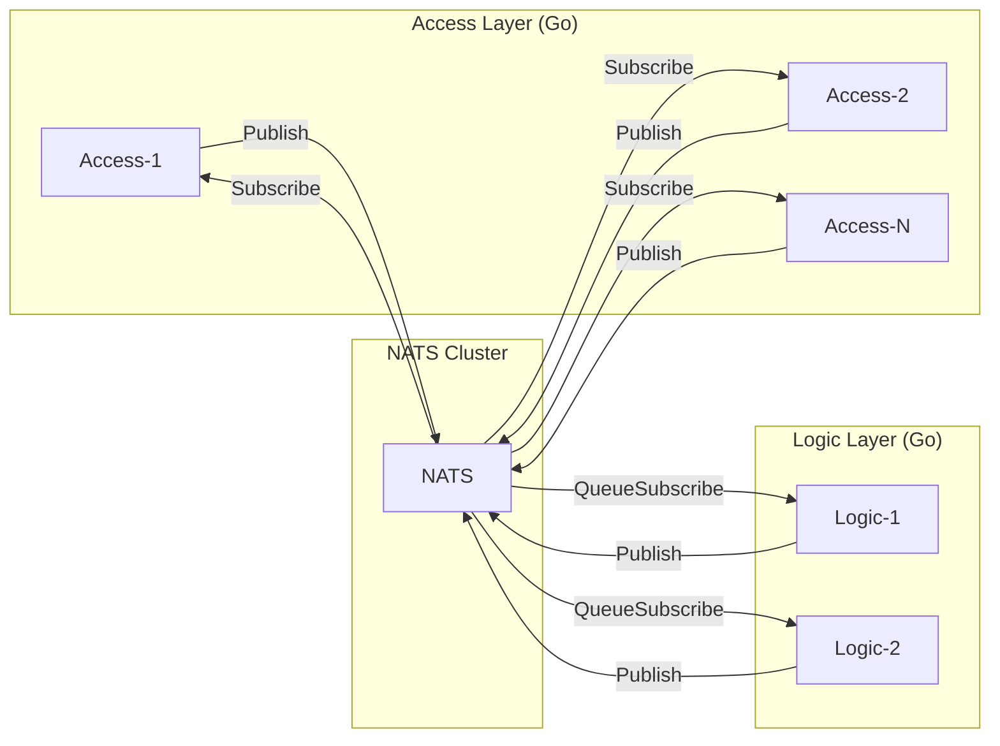
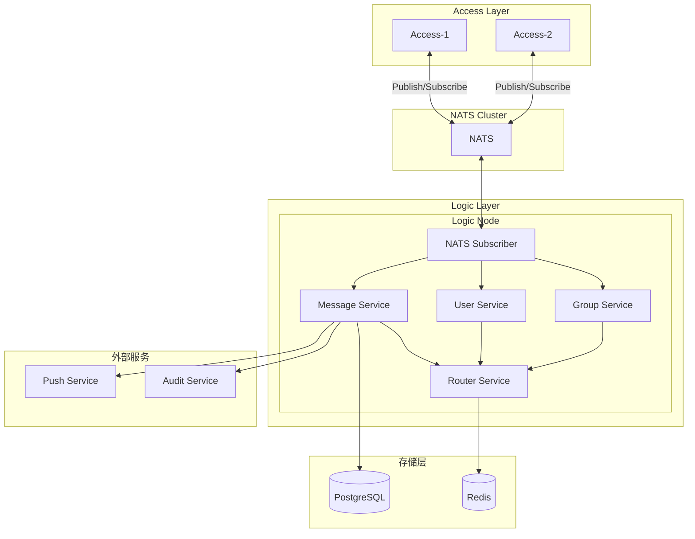
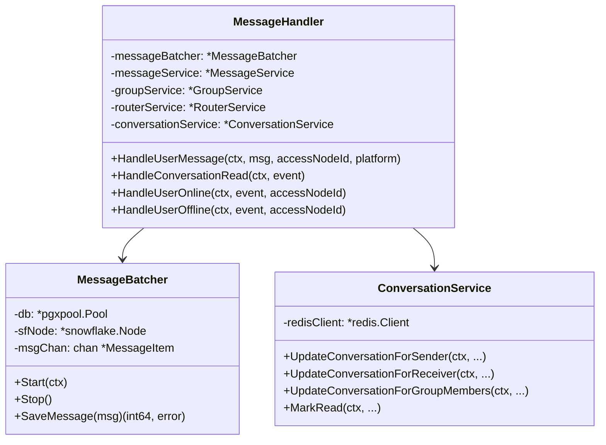
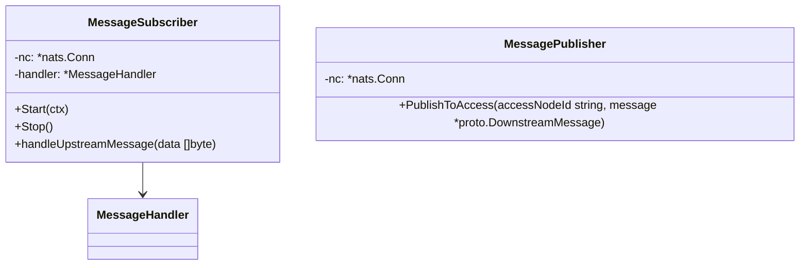
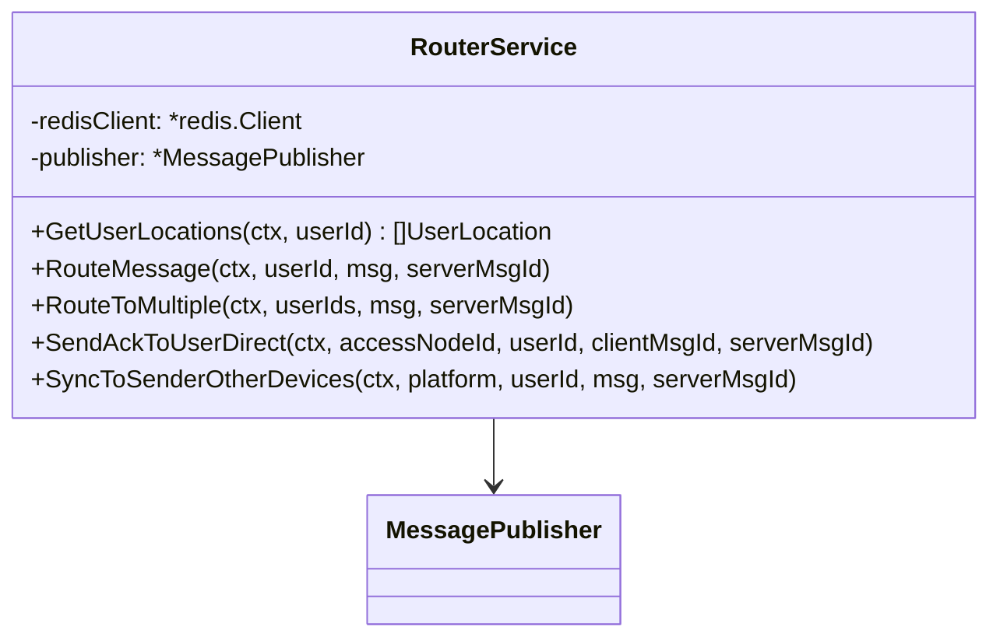
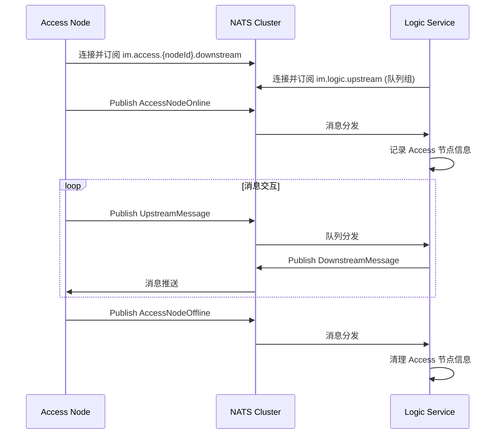
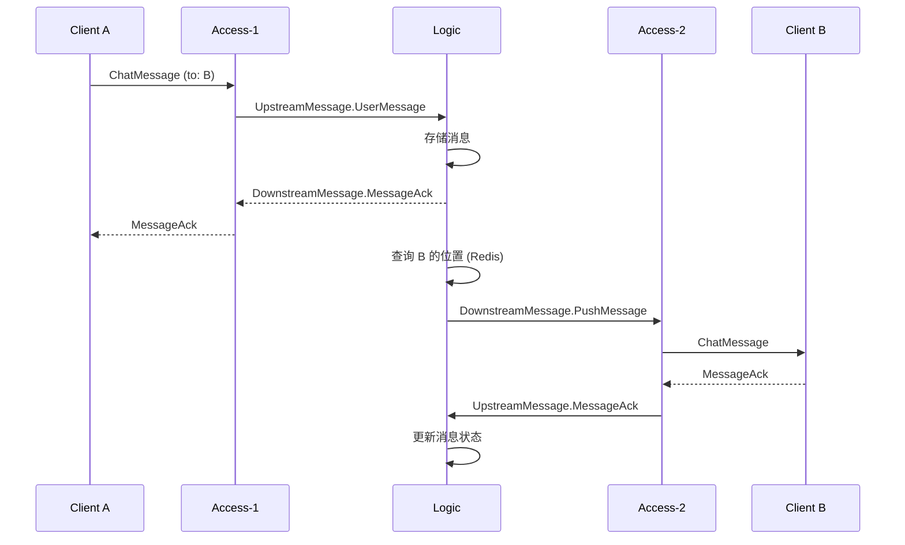
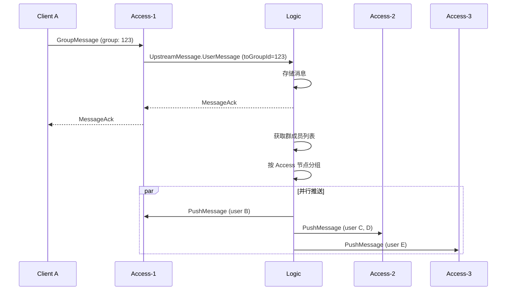
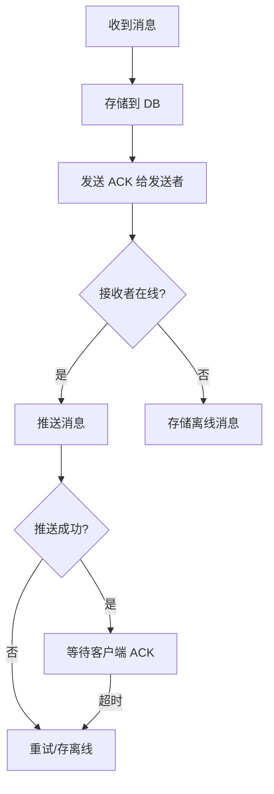

# IM Logic Layer 架构设计

基于 Go 的即时通讯系统逻辑层架构设计文档。

---

## 1. 系统概述

Logic Layer（逻辑层）是 IM 系统的业务核心，负责消息处理、用户管理、群组管理等核心业务逻辑。

### 1.1 核心职责

| 职责 | 描述 |
|------|------|
| 消息处理 | 消息存储、转发、离线消息管理 |
| 用户管理 | 用户状态、在线信息、多端同步 |
| 群组管理 | 群消息扩散、成员管理 |
| 消息路由 | 根据用户位置路由到正确的 Access 节点 |

### 1.2 技术选型

```
┌─────────────────────────────────────────────────────────┐
│                    技术栈                                │
├─────────────────┬───────────────────────────────────────┤
│ 语言            │ Go 1.25.5                               │
│ 内部通信        │ NATS (nats.go 官方客户端)              │
│ 数据库          │ PostgreSQL                            │
│ ORM             │ sqlc / pgx                            │
│ 缓存            │ go-redis                              │
│ 并发            │ Goroutines + Channels                 │
│ 日志            │ log/slog 或 zerolog                   │
│ 配置            │ Viper                                  │
└─────────────────┴───────────────────────────────────────┘
```

> [!IMPORTANT]
> **无 HTTP 服务**：本服务不包含任何 HTTP 服务器，通过 NATS 与 Access 层通信。
> 所有 I/O 操作均为非阻塞，充分利用 Go 的并发特性。

### 1.3 与 Access 层通信



---

## 2. 整体架构



---

## 3. 模块设计

### 3.1 项目目录结构

```
logic-go/
├── cmd/
│   └── logic/
│       └── main.go                 # 程序入口
├── configs/
│   └── config.yaml                 # 配置文件
├── internal/
│   ├── config/
│   │   └── config.go               # 配置加载
│   ├── handler/
│   │   └── message_handler.go      # 消息处理器
│   ├── model/
│   │   ├── conversation.go         # 会话模型
│   │   └── message.go              # 消息模型
│   ├── nats/
│   │   ├── client.go               # NATS 客户端
│   │   ├── subscriber.go           # 消息订阅器
│   │   └── publisher.go            # 消息发布器
│   ├── repository/
│   │   └── message.go              # 消息数据访问
│   └── service/
│       ├── conversation.go         # 会话服务
│       ├── group.go                # 群组业务
│       ├── message.go              # 消息业务
│       ├── message_batcher.go      # 消息批量写入器
│       └── router.go               # 路由服务
├── go.mod
└── go.sum
```

### 3.2 核心模块详解

#### 3.2.1 消息处理器



#### 3.2.2 NATS 消息服务



#### 3.2.3 消息路由服务



> [!NOTE]
> 用户位置 (UserLocation) 的注册与注销由 **Access 层** 直接管理，Logic 层仅读取 Redis 中的位置信息进行消息路由。

---

## 5. 核心代码实现

### 5.1 NATS 订阅者实现

```go
package nats

import (
    "context"
    "log/slog"

    "github.com/nats-io/nats.go"
    "sudooom.im.logic/internal/handler"
    "sudooom.im.shared/proto"
)

type MessageSubscriber struct {
    nc      *nats.Conn
    handler *handler.MessageHandler
    config  SubscriberConfig
    logger  *slog.Logger
}

type SubscriberConfig struct {
    WorkerCount int
    BufferSize  int
}

func NewMessageSubscriber(
    nc *nats.Conn,
    handler *handler.MessageHandler,
    config SubscriberConfig,
) *MessageSubscriber {
    return &MessageSubscriber{
        nc:      nc,
        handler: handler,
        config:  config,
        logger:  slog.Default(),
    }
}

func (s *MessageSubscriber) Start(ctx context.Context) error {
    // 订阅上行消息 - 使用队列组实现负载均衡
    _, err := s.nc.QueueSubscribe("im.logic.upstream", "logic-group", func(msg *nats.Msg) {
        go s.handleUpstreamMessage(ctx, msg.Data)
    })
    if err != nil {
        return err
    }

    s.logger.Info("NATS subscriber started", "subject", "im.logic.upstream")
    return nil
}

func (s *MessageSubscriber) handleUpstreamMessage(ctx context.Context, data []byte) {
    message, err := proto.DecodeUpstreamMessage(data)
    if err != nil {
        s.logger.Error("Failed to decode message", "error", err)
        return
    }

    accessNodeId := message.AccessNodeId
    platform := message.Platform

    switch {
    case message.UserMessage != nil:
        s.handler.HandleUserMessage(ctx, message.UserMessage, accessNodeId, platform)
    case message.UserOnline != nil:
        s.handler.HandleUserOnline(ctx, message.UserOnline, accessNodeId)
    case message.UserOffline != nil:
        s.handler.HandleUserOffline(ctx, message.UserOffline, accessNodeId)
    case message.ConversationRead != nil:
        s.handler.HandleConversationRead(ctx, message.ConversationRead)
    }
}

func (s *MessageSubscriber) Stop() {
    s.logger.Info("NATS subscriber stopped")
}
```


### 5.2 NATS 发布者 (用于下行推送)

```go
package nats

import (
    "fmt"
    "log/slog"

    "github.com/nats-io/nats.go"
    "google.golang.org/protobuf/proto"
)

type MessagePublisher struct {
    nc     *nats.Conn
    logger *slog.Logger
}

func NewMessagePublisher(nc *nats.Conn) *MessagePublisher {
    return &MessagePublisher{
        nc:     nc,
        logger: slog.Default(),
    }
}

// PublishToAccess 推送消息到指定 Access 节点
func (p *MessagePublisher) PublishToAccess(accessNodeId string, message *pb.DownstreamMessage) error {
    subject := fmt.Sprintf("im.access.%s.downstream", accessNodeId)
    data, err := proto.Marshal(message)
    if err != nil {
        return err
    }
    return p.nc.Publish(subject, data)
}

// Broadcast 广播消息到所有 Access 节点
func (p *MessagePublisher) Broadcast(message *pb.DownstreamMessage) error {
    data, err := proto.Marshal(message)
    if err != nil {
        return err
    }
    return p.nc.Publish("im.access.broadcast", data)
}
```

### 5.3 路由服务

```go
package service

import (
    "context"
    "encoding/json"
    "fmt"
    "log/slog"
    "sync"
    "time"

    "github.com/redis/go-redis/v9"
)

const (
    userLocationKeyPrefix = "im:user:location:"
    locationTTL           = 24 * time.Hour
)

type RouterService struct {
    redisClient *redis.Client
    publisher   *nats.MessagePublisher
    logger      *slog.Logger
}

type UserLocation struct {
    UserId       int64     `json:"userId"`
    AccessNodeId string    `json:"accessNodeId"`
    ConnId       int64     `json:"connId"`
    DeviceId     string    `json:"deviceId"`
    Platform     string    `json:"platform"`
    LoginTime    time.Time `json:"loginTime"`
}

func NewRouterService(redisClient *redis.Client, publisher *nats.MessagePublisher) *RouterService {
    return &RouterService{
        redisClient: redisClient,
        publisher:   publisher,
        logger:      slog.Default(),
    }
}

// GetUserLocations 获取用户所在的 Access 节点
func (s *RouterService) GetUserLocations(ctx context.Context, userId int64) ([]UserLocation, error) {
    key := fmt.Sprintf("%s%d", userLocationKeyPrefix, userId)

    entries, err := s.redisClient.HGetAll(ctx, key).Result()
    if err != nil {
        return nil, err
    }

    locations := make([]UserLocation, 0, len(entries))
    for _, value := range entries {
        var loc UserLocation
        if err := json.Unmarshal([]byte(value), &loc); err != nil {
            continue
        }
        locations = append(locations, loc)
    }

    return locations, nil
}

// RegisterUserLocation 注册用户位置
func (s *RouterService) RegisterUserLocation(ctx context.Context, location *UserLocation) error {
    key := fmt.Sprintf("%s%d", userLocationKeyPrefix, location.UserId)
    field := fmt.Sprintf("%s:%d", location.AccessNodeId, location.ConnId)

    value, err := json.Marshal(location)
    if err != nil {
        return err
    }

    pipe := s.redisClient.Pipeline()
    pipe.HSet(ctx, key, field, value)
    pipe.Expire(ctx, key, locationTTL)
    _, err = pipe.Exec(ctx)

    s.logger.Debug("Registered user location",
        "userId", location.UserId,
        "accessNodeId", location.AccessNodeId)

    return err
}

// RemoveUserLocation 移除用户位置
func (s *RouterService) RemoveUserLocation(ctx context.Context, userId int64, accessNodeId string, connId int64) error {
    key := fmt.Sprintf("%s%d", userLocationKeyPrefix, userId)
    field := fmt.Sprintf("%s:%d", accessNodeId, connId)

    s.logger.Debug("Unregistered user location",
        "userId", userId,
        "connId", connId)

    return s.redisClient.HDel(ctx, key, field).Err()
}

// RouteMessage 路由消息到用户
func (s *RouterService) RouteMessage(ctx context.Context, userId int64, message *pb.PushMessage) error {
    locations, err := s.GetUserLocations(ctx, userId)
    if err != nil {
        return err
    }

    if len(locations) == 0 {
        s.logger.Debug("User is offline, saving to offline storage", "userId", userId)
        // TODO: offlineMessageService.Save(userId, message)
        return nil
    }

    // 按 Access 节点分组并行推送
    nodeLocations := make(map[string][]UserLocation)
    for _, loc := range locations {
        nodeLocations[loc.AccessNodeId] = append(nodeLocations[loc.AccessNodeId], loc)
    }

    var wg sync.WaitGroup
    for accessNodeId := range nodeLocations {
        wg.Add(1)
        go func(nodeId string) {
            defer wg.Done()
            downstreamMsg := &pb.DownstreamMessage{
                Payload: &pb.DownstreamMessage_PushMessage{
                    PushMessage: message,
                },
            }
            if err := s.publisher.PublishToAccess(nodeId, downstreamMsg); err != nil {
                s.logger.Warn("Failed to route message to access node",
                    "accessNodeId", nodeId,
                    "error", err)
            }
        }(accessNodeId)
    }
    wg.Wait()

    return nil
}

// RouteToMultiple 批量路由消息（群消息）- 并行处理
func (s *RouterService) RouteToMultiple(ctx context.Context, userIds []int64, message *pb.PushMessage) error {
    // 并行获取所有用户位置
    type userLoc struct {
        userId    int64
        locations []UserLocation
    }

    results := make(chan userLoc, len(userIds))
    var wg sync.WaitGroup

    for _, userId := range userIds {
        wg.Add(1)
        go func(uid int64) {
            defer wg.Done()
            locs, _ := s.GetUserLocations(ctx, uid)
            results <- userLoc{userId: uid, locations: locs}
        }(userId)
    }

    go func() {
        wg.Wait()
        close(results)
    }()

    // 按 Access 节点分组
    nodeToUsers := make(map[string][]int64)
    for result := range results {
        for _, loc := range result.locations {
            nodeToUsers[loc.AccessNodeId] = append(nodeToUsers[loc.AccessNodeId], result.userId)
        }
    }

    // 并行发送
    var sendWg sync.WaitGroup
    for accessNodeId, users := range nodeToUsers {
        sendWg.Add(1)
        go func(nodeId string, targetUsers []int64) {
            defer sendWg.Done()
            for _, userId := range targetUsers {
                downstreamMsg := &pb.DownstreamMessage{
                    Payload: &pb.DownstreamMessage_PushMessage{
                        PushMessage: message,
                    },
                }
                s.publisher.PublishToAccess(nodeId, downstreamMsg)
            }
        }(accessNodeId, users)
    }
    sendWg.Wait()

    return nil
}
```

---

## 6. 核心流程

### 6.1 Access 节点连接流程



### 6.2 单聊消息处理流程



### 6.3 群聊消息处理流程



---

## 7. 关键设计

### 7.1 连接管理

| 场景 | 处理方式 |
|------|----------|
| Access 断线 | NATS 自动清理订阅，用户位置保留到 TTL |
| Logic 重启 | NATS 队列组自动负载均衡 |
| 用户多端 | 同一用户多个 Location，按需推送 |

### 7.2 消息可靠性



### 7.3 群消息扩散策略

| 策略 | 适用场景 | 实现 |
|------|----------|------|
| 写扩散 | 小群 (<100人) | 为每个在线成员发送推送 |
| 读扩散 | 大群 (>100人) | 只推送通知，客户端拉取 |
| 混合 | 通用 | 在线成员写扩散，离线成员读扩散 |

---

## 8. 配置示例

### 8.1 config.yaml

```yaml
# Logic 服务配置
app:
  name: im-logic
  log_level: debug

# NATS 配置
nats:
  url: nats://localhost:4222
  # cluster:
  #   urls:
  #     - nats://nats-1:4222
  #     - nats://nats-2:4222
  #     - nats://nats-3:4222
  max_reconnects: -1  # 无限重连
  reconnect_wait: 2s

# PostgreSQL
database:
  host: localhost
  port: 5432
  name: im
  user: postgres
  password: password
  max_open_conns: 50
  max_idle_conns: 10
  conn_max_lifetime: 30m

# Redis
redis:
  host: localhost
  port: 6379
  password: ""
  db: 0
  pool_size: 50
  # cluster:
  #   addrs:
  #     - redis-1:6379
  #     - redis-2:6379
  #     - redis-3:6379
```

### 8.2 main.go

```go
package main

import (
    "context"
    "log/slog"
    "os"
    "os/signal"
    "syscall"

    "github.com/jackc/pgx/v5/pgxpool"
    "github.com/redis/go-redis/v9"

    "sudooom.im.logic/internal/config"
    "sudooom.im.logic/internal/handler"
    imNats "sudooom.im.logic/internal/nats"
    "sudooom.im.logic/internal/service"
    "sudooom.im.shared/snowflake"
)

func main() {
    // 初始化日志
    logger := slog.New(slog.NewJSONHandler(os.Stdout, &slog.HandlerOptions{
        Level: slog.LevelDebug,
    }))
    slog.SetDefault(logger)

    // 加载配置
    cfg, err := config.Load("configs/config.yaml")
    if err != nil {
        logger.Error("Failed to load config", "error", err)
        os.Exit(1)
    }

    ctx, cancel := context.WithCancel(context.Background())
    defer cancel()

    // 连接 NATS
    natsClient, err := imNats.NewClient(cfg.NATS)
    if err != nil {
        logger.Error("Failed to connect to NATS", "error", err)
        os.Exit(1)
    }
    defer natsClient.Close()

    // 连接 Redis
    redisClient := connectRedis(cfg.Redis)
    defer redisClient.Close()

    // 连接数据库
    db, err := connectDatabase(ctx, cfg.Database)
    if err != nil {
        logger.Error("Failed to connect to database", "error", err)
        os.Exit(1)
    }
    defer db.Close()

    // 初始化雪花ID生成器
    sfNode, _ := snowflake.NewNode(1)

    // 初始化服务
    publisher := imNats.NewMessagePublisher(natsClient.Conn())
    routerService := service.NewRouterService(redisClient, publisher)
    groupService := service.NewGroupService(db)
    messageService := service.NewMessageService(db)

    // 创建消息批量写入器
    messageBatcher := service.NewMessageBatcher(db, sfNode, service.MessageBatcherConfig{
        BatchSize:     cfg.Batch.Size,
        FlushInterval: cfg.Batch.FlushInterval,
    })
    messageBatcher.Start(ctx)

    // 创建会话服务
    conversationService := service.NewConversationService(redisClient)

    // 创建消息处理器
    msgHandler := handler.NewMessageHandler(
        messageBatcher,
        messageService,
        groupService,
        routerService,
        conversationService,
    )

    // 启动订阅者
    subscriber := imNats.NewMessageSubscriber(natsClient.Conn(), msgHandler, imNats.SubscriberConfig{
        WorkerCount: cfg.NATS.WorkerCount,
        BufferSize:  cfg.NATS.BufferSize,
    })
    if err := subscriber.Start(ctx); err != nil {
        logger.Error("Failed to start subscriber", "error", err)
        os.Exit(1)
    }

    logger.Info("Logic service started")

    // 优雅退出
    quit := make(chan os.Signal, 1)
    signal.Notify(quit, syscall.SIGINT, syscall.SIGTERM)
    <-quit

    logger.Info("Shutting down...")
    cancel()
    subscriber.Stop()
    messageBatcher.Stop()
}
```

### 8.3 go.mod

```go
module sudooom.im.logic

go 1.25

require (
    github.com/nats-io/nats.go v1.31.0
    github.com/redis/go-redis/v9 v9.3.0
    github.com/jackc/pgx/v5 v5.5.0
    github.com/spf13/viper v1.17.0
    google.golang.org/protobuf v1.31.0
)
```

---

## 9. 监控与运维

### 9.1 关键指标

| 指标 | 描述 |
|------|------|
| `logic_nats_connections_active` | 当前活跃的 NATS 连接数 |
| `logic_messages_processed` | 处理的消息数 (按类型) |
| `logic_message_latency` | 消息处理延迟 |
| `logic_route_failures` | 路由失败次数 |
| `logic_db_query_time` | 数据库查询耗时 |

### 9.2 健康检查

```go
package health

import (
    "context"
    "net/http"
    "time"

    "github.com/nats-io/nats.go"
    "github.com/redis/go-redis/v9"
)

type HealthChecker struct {
    nc          *nats.Conn
    redisClient *redis.Client
}

func NewHealthChecker(nc *nats.Conn, redisClient *redis.Client) *HealthChecker {
    return &HealthChecker{nc: nc, redisClient: redisClient}
}

func (h *HealthChecker) Check(ctx context.Context) map[string]string {
    status := make(map[string]string)

    // 检查 NATS
    if h.nc.IsConnected() {
        status["nats"] = "connected"
    } else {
        status["nats"] = "disconnected"
    }

    // 检查 Redis
    ctx, cancel := context.WithTimeout(ctx, 2*time.Second)
    defer cancel()

    if err := h.redisClient.Ping(ctx).Err(); err == nil {
        status["redis"] = "connected"
    } else {
        status["redis"] = "disconnected"
    }

    return status
}

// ServeHTTP 可选的 HTTP 健康检查端点
func (h *HealthChecker) ServeHTTP(w http.ResponseWriter, r *http.Request) {
    status := h.Check(r.Context())
    for k, v := range status {
        if v != "connected" {
            w.WriteHeader(http.StatusServiceUnavailable)
            break
        }
    }
    json.NewEncoder(w).Encode(status)
}
```

---

## 10. 后续演进

- [ ] 消息存储分库分表
- [ ] 群消息读扩散优化
- [ ] 消息搜索 (Elasticsearch)
- [ ] 已读回执批量处理
- [ ] 消息撤回机制
- [ ] 端到端加密支持
