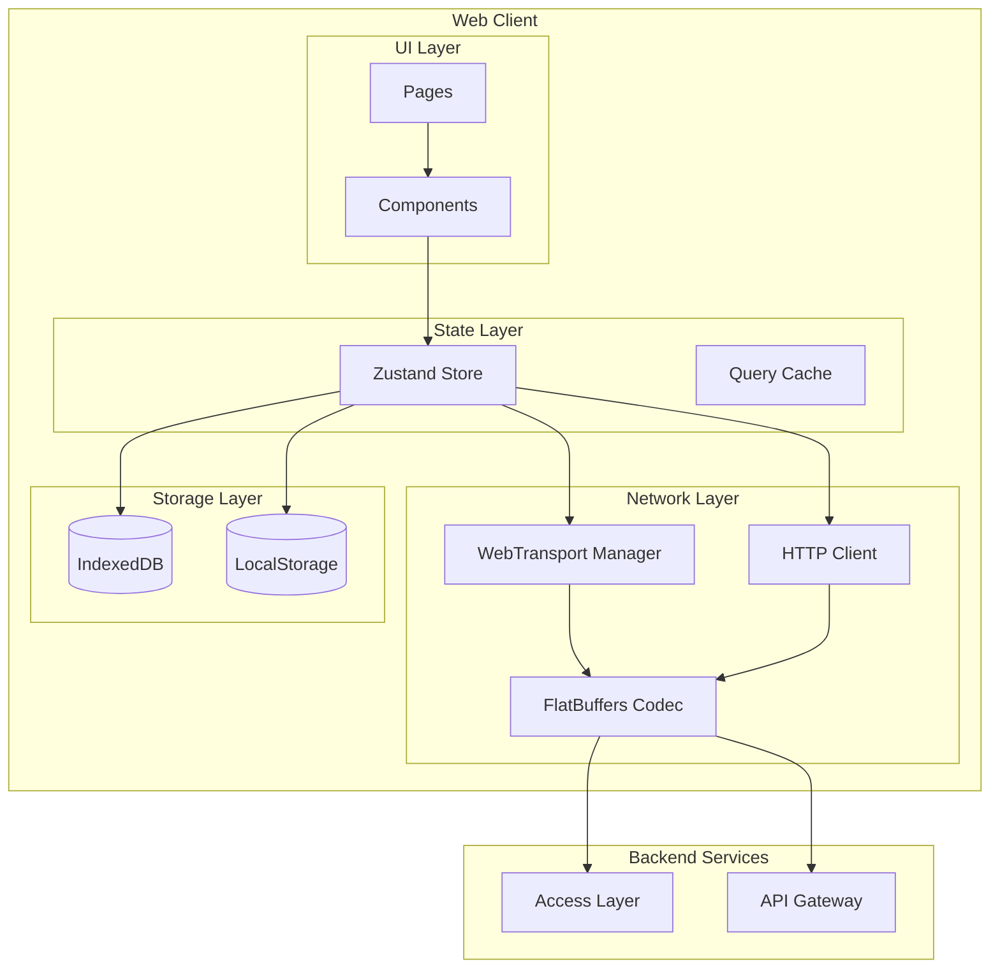
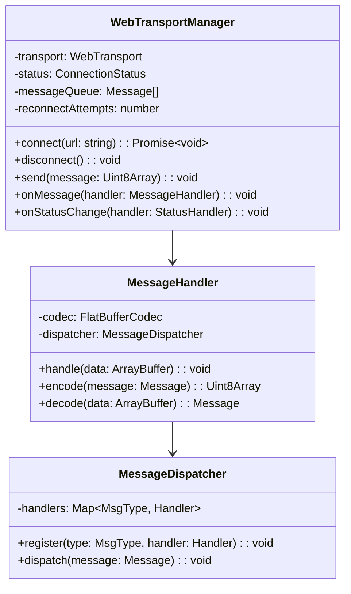
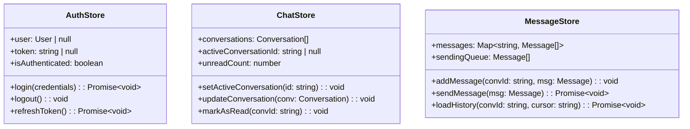
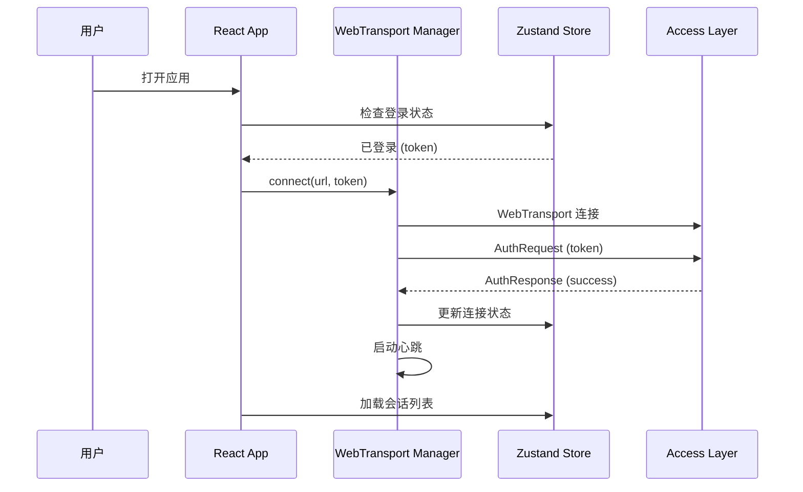
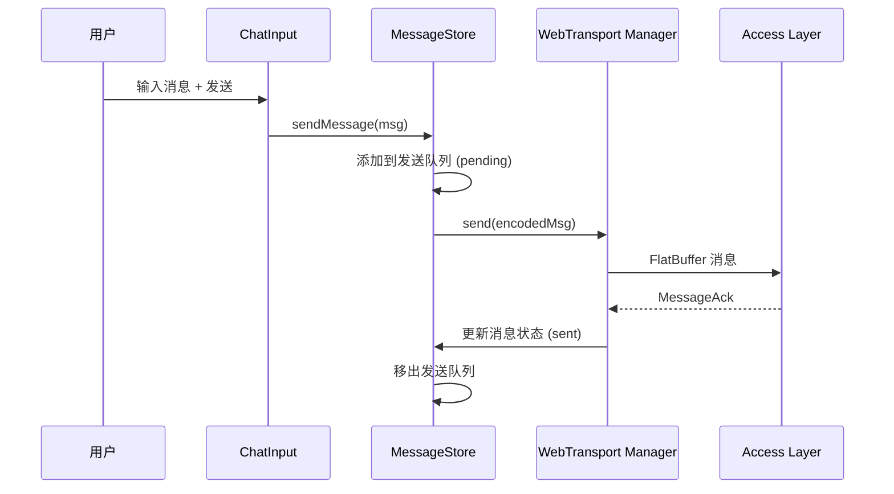
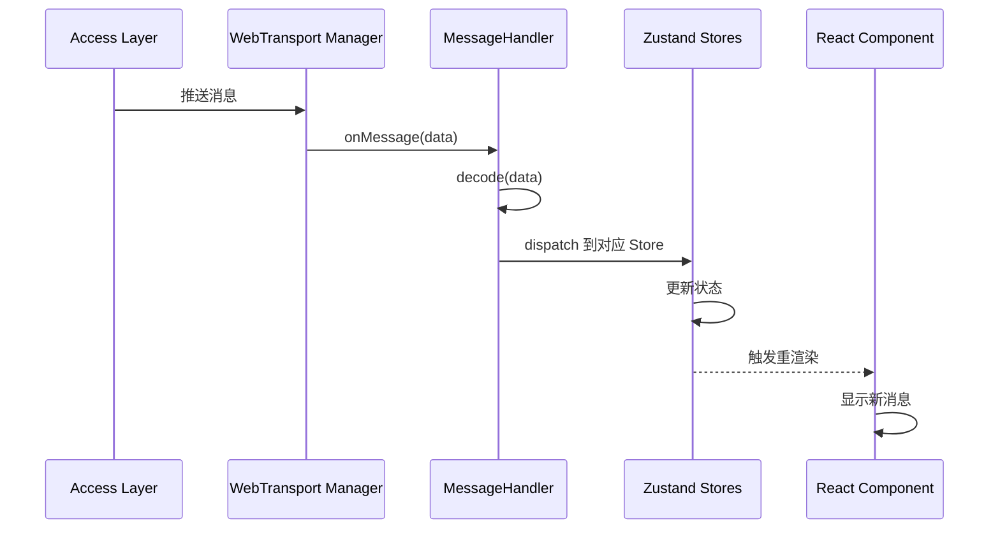
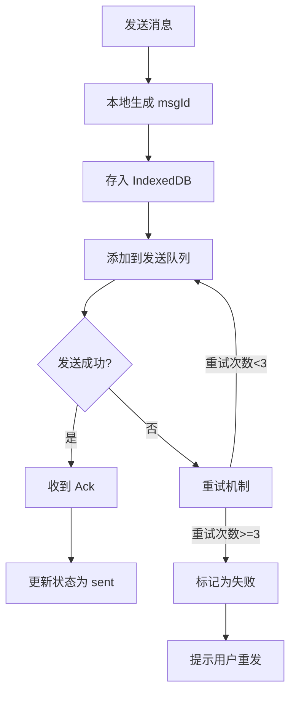
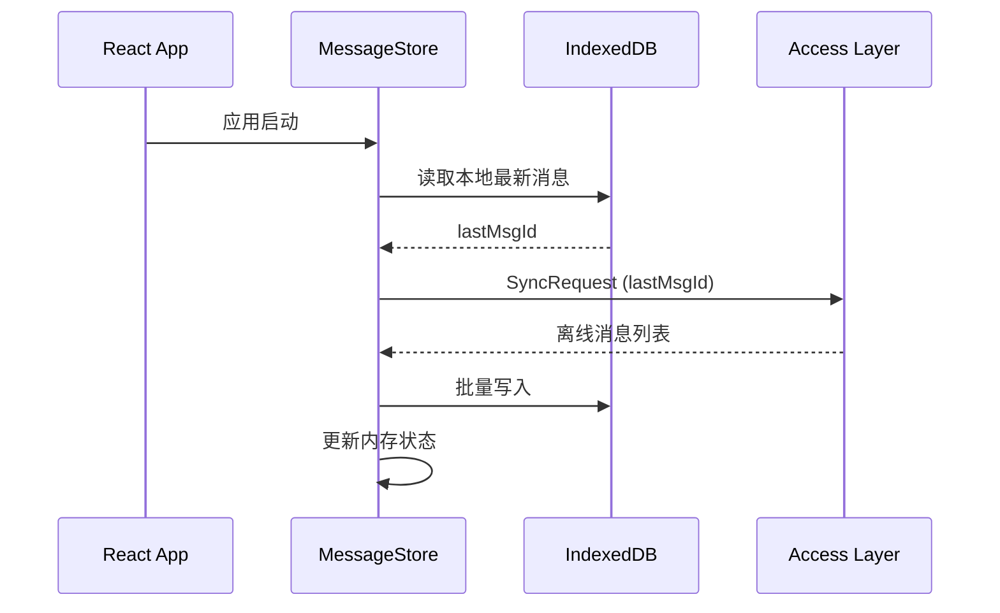

# IM Web Client 架构设计

基于 React + TypeScript + Vite + FlatBuffers 的即时通讯系统 Web 客户端架构设计文档。

---

## 1. 系统概述

Web Client 是 IM 系统的 Web 端实现，负责用户界面展示、消息收发、实时通信等核心功能。

### 1.1 核心职责

| 职责 | 描述 |
|------|------|
| 连接管理 | WebTransport/QUIC 长连接维护 |
| 消息渲染 | 聊天消息展示、多媒体预览 |
| 状态管理 | 会话列表、消息队列、用户状态 |
| 离线支持 | IndexedDB 本地存储、离线消息同步 |
| 通知推送 | 浏览器通知、消息提醒 |

### 1.2 技术选型

```
┌─────────────────────────────────────────────────────────┐
│                    技术栈                                │
├─────────────────┬───────────────────────────────────────┤
│ 语言            │ TypeScript 5.9.3                      │
│ 框架            │ React 19.2.3                          │
│ 构建工具        │ Vite 7.3.0                            │
│ UI 组件库       │ Ant Design 6.1.0                      │
│ 序列化协议      │ FlatBuffers 25.9.23                   │
│ 状态管理        │ Zustand 5.x                           │
│ 路由            │ React Router 7.x                      │
│ 样式方案        │ CSS Modules + Ant Design Token        │
└─────────────────┴───────────────────────────────────────┘
```

> [!IMPORTANT]
> **React 版本说明**：React 19 曾存在 CVE-2025-55182 (CVSS 10.0) 远程代码执行漏洞。
> 本项目使用 **React 19.2.3**，该版本已修复所有已知安全漏洞。

### 1.3 浏览器支持

| 浏览器 | 版本要求 |
|--------|----------|
| Chrome | 90+ |
| Firefox | 88+ |
| Safari | 15+ |
| Edge | 90+ |

---

## 2. 整体架构



---

## 3. 模块设计

### 3.1 项目目录结构

```
im-web/
├── public/
│   └── favicon.ico
├── src/
│   ├── main.tsx                      # 入口
│   ├── App.tsx                       # 根组件
│   ├── vite-env.d.ts
│   ├── assets/                       # 静态资源
│   │   ├── images/
│   │   └── fonts/
│   ├── components/                   # 通用组件
│   │   ├── Avatar/
│   │   ├── MessageBubble/
│   │   ├── ChatInput/
│   │   └── VirtualList/
│   ├── pages/                        # 页面组件
│   │   ├── Login/
│   │   ├── Chat/
│   │   ├── Contacts/
│   │   └── Settings/
│   ├── hooks/                        # 自定义 Hooks
│   │   ├── useWebTransport.ts
│   │   ├── useMessage.ts
│   │   └── useAuth.ts
│   ├── stores/                       # 状态管理
│   │   ├── authStore.ts
│   │   ├── chatStore.ts
│   │   ├── messageStore.ts
│   │   └── uiStore.ts
│   ├── services/                     # 业务服务
│   │   ├── transport/
│   │   │   ├── WebTransportManager.ts
│   │   │   └── MessageHandler.ts
│   │   ├── api/
│   │   │   ├── client.ts
│   │   │   └── endpoints.ts
│   │   └── storage/
│   │       └── IndexedDBService.ts
│   ├── protocol/                     # FlatBuffers 生成代码
│   │   ├── message_generated.ts
│   │   └── codec.ts
│   ├── utils/                        # 工具函数
│   │   ├── format.ts
│   │   └── crypto.ts
│   ├── types/                        # 类型定义
│   │   └── index.ts
│   └── styles/                       # 全局样式
│       ├── variables.css
│       └── global.css
├── schema/                           # FlatBuffers Schema (共享)
│   └── message.fbs
├── index.html
├── vite.config.ts
├── tsconfig.json
├── tsconfig.node.json
├── package.json
└── pnpm-lock.yaml
```

### 3.2 核心模块详解

#### 3.2.1 WebTransport 管理器



#### 3.2.2 状态管理 (Zustand)



#### 3.2.3 FlatBuffers 编解码

```tsx
// protocol/codec.ts
import * as flatbuffers from 'flatbuffers';
import { Packet, ChatMessage, MsgType } from './message_generated';

export class FlatBufferCodec {
    encode(message: OutgoingMessage): Uint8Array {
        const builder = new flatbuffers.Builder(256);

        // 构建 ChatMessage
        const contentOffset = builder.createString(message.content);
        const msgIdOffset = builder.createString(message.msgId);

        ChatMessage.startChatMessage(builder);
        ChatMessage.addMsgId(builder, msgIdOffset);
        ChatMessage.addFromUser(builder, BigInt(message.fromUserId));
        ChatMessage.addToUser(builder, BigInt(message.toUserId));
        ChatMessage.addContent(builder, contentOffset);
        ChatMessage.addContentType(builder, message.contentType);
        ChatMessage.addTimestamp(builder, BigInt(Date.now()));
        const chatMsgOffset = ChatMessage.endChatMessage(builder);

        // 构建 Packet
        Packet.startPacket(builder);
        Packet.addSeq(builder, BigInt(this.nextSeq()));
        Packet.addMsgType(builder, MsgType.Message);
        Packet.addTimestamp(builder, BigInt(Date.now()));
        Packet.addPayload(builder, chatMsgOffset);
        const packetOffset = Packet.endPacket(builder);

        builder.finish(packetOffset);
        return builder.asUint8Array();
    }

    decode(buffer: ArrayBuffer): IncomingMessage {
        const bytes = new Uint8Array(buffer);
        const buf = new flatbuffers.ByteBuffer(bytes);
        const packet = Packet.getRootAsPacket(buf);

        return {
            seq: packet.seq(),
            msgType: packet.msgType(),
            timestamp: packet.timestamp(),
            payload: this.decodePayload(packet),
        };
    }
}
```

---

## 4. 核心流程

### 4.1 连接建立流程



### 4.2 消息发送流程



### 4.3 消息接收流程



---

## 5. 关键设计

### 5.1 消息可靠性



### 5.2 离线消息同步



### 5.3 虚拟列表优化

| 策略 | 描述 |
|------|------|
| 窗口化渲染 | 只渲染可视区域 + buffer 的消息 |
| 动态高度 | 支持不同类型消息的动态高度计算 |
| 滚动锚定 | 新消息到来时保持滚动位置 |
| 懒加载 | 滚动到顶部时加载历史消息 |

---

## 6. 配置示例

### 6.1 vite.config.ts

```tsx
import { defineConfig } from 'vite';
import react from '@vitejs/plugin-react';
import path from 'path';

export default defineConfig({
    plugins: [react()],
    resolve: {
        alias: {
            '@': path.resolve(__dirname, './src'),
        },
    },
    server: {
        port: 3000,
        proxy: {
            '/api': {
                target: 'http://localhost:8080',
                changeOrigin: true,
            },
            '/ws': {
                target: 'ws://localhost:8443',
                ws: true,
            },
        },
    },
    build: {
        target: 'esnext',
        minify: 'esbuild',
        sourcemap: true,
    },
});
```

### 6.2 package.json

```json
{
    "name": "im-web",
    "version": "1.0.0",
    "type": "module",
    "scripts": {
        "dev": "vite",
        "build": "tsc && vite build",
        "preview": "vite preview",
        "lint": "eslint . --ext ts,tsx",
        "flatc": "flatc --ts -o src/protocol ../schema/message.fbs"
    },
    "dependencies": {
        "react": "^19.2.3",
        "react-dom": "^19.2.3",
        "react-router-dom": "^7.10.1",
        "antd": "^6.1.0",
        "@ant-design/icons": "^6.1.0",
        "zustand": "^5.0.9",
        "flatbuffers": "^25.9.23",
        "dayjs": "^1.11.19",
        "idb": "^8.0.3"
    },
    "devDependencies": {
        "@types/react": "^19.0.0",
        "@types/react-dom": "^19.0.0",
        "@vitejs/plugin-react": "^5.1.2",
        "typescript": "~5.9.3",
        "vite": "^7.3.0",
        "eslint": "^9.39.1",
        "@eslint/js": "^9.39.1",
        "typescript-eslint": "^8.18.0"
    }
}
```

### 6.3 tsconfig.json

```json
{
    "compilerOptions": {
        "target": "ES2022",
        "lib": ["ES2022", "DOM", "DOM.Iterable"],
        "module": "ESNext",
        "moduleResolution": "bundler",
        "strict": true,
        "jsx": "react-jsx",
        "esModuleInterop": true,
        "skipLibCheck": true,
        "resolveJsonModule": true,
        "isolatedModules": true,
        "noEmit": true,
        "baseUrl": ".",
        "paths": {
            "@/*": ["src/*"]
        }
    },
    "include": ["src"],
    "references": [{ "path": "./tsconfig.node.json" }]
}
```

---

## 7. 安全设计

### 7.1 Token 管理

| 策略 | 说明 |
|------|------|
| 存储位置 | httpOnly Cookie (推荐) 或 内存 |
| 刷新机制 | Access Token 过期前自动刷新 |
| 登出处理 | 清除所有本地凭证 |

### 7.2 XSS 防护

```tsx
// 消息内容渲染时进行转义
import DOMPurify from 'dompurify';

const sanitizeMessage = (content: string): string => {
    return DOMPurify.sanitize(content, {
        ALLOWED_TAGS: ['b', 'i', 'em', 'strong', 'a'],
        ALLOWED_ATTR: ['href'],
    });
};
```

---

## 8. 性能优化

### 8.1 优化策略

| 策略 | 实现 |
|------|------|
| 代码分割 | React.lazy + Suspense |
| 资源预加载 | 关键页面 prefetch |
| 图片懒加载 | loading="lazy" + IntersectionObserver |
| 消息缓存 | IndexedDB + 内存 LRU Cache |
| WebTransport 复用 | 单例连接管理 |

### 8.2 Bundle 优化

```tsx
// vite.config.ts - 分包策略
build: {
    rollupOptions: {
        output: {
            manualChunks: {
                vendor: ['react', 'react-dom', 'react-router-dom'],
                antd: ['antd', '@ant-design/icons'],
                utils: ['dayjs', 'flatbuffers'],
            },
        },
    },
},
```

---

## 9. 监控与调试

### 9.1 关键指标

| 指标 | 描述 |
|------|------|
| `wt_connection_status` | WebTransport 连接状态 |
| `message_send_latency` | 消息发送延迟 |
| `message_render_time` | 消息渲染耗时 |
| `reconnect_count` | 重连次数 |

### 9.2 调试工具

- React DevTools：组件状态调试
- Zustand DevTools：状态变更追踪
- Network Panel：WebTransport/QUIC 帧分析

---

## 10. 后续演进

- [ ] PWA 支持 (Service Worker)
- [x] WebTransport 协议升级 ✓
- [ ] 端到端加密 (E2EE)
- [ ] 语音/视频通话 (WebRTC)
- [ ] 消息搜索 (全文检索)
- [ ] 国际化 (i18n)
