# IM Web Layer 架构设计

基于 Go + Gin + JWT 的即时通讯系统 REST API 层架构设计文档。

---

## 1. 系统概述

Web Layer（REST API 层）是 IM 系统的 HTTP 接口层，负责处理用户注册登录、好友管理、用户查询等核心 REST 功能。

### 1.1 核心职责

| 职责 | 描述 |
|------|------|
| 用户认证 | 注册、登录、Token 管理 |
| 用户管理 | 用户信息查询、资料更新 |
| 好友管理 | 添加/删除好友、好友列表 |
| Token 签发 | JWT Token 生成与验证 |

### 1.2 技术选型

```
┌─────────────────────────────────────────────────────────┐
│                    技术栈                                │
├─────────────────┬───────────────────────────────────────┤
│ 语言            │ Go 1.25.5                             │
│ Web 框架        │ Gin                                   │
│ 认证方案        │ JWT (golang-jwt/jwt)                  │
│ 数据库          │ PostgreSQL                            │
│ 缓存            │ Redis                                 │
│ 密码加密        │ bcrypt                                │
│ 配置管理        │ Viper                                 │
│ 日志            │ slog                                  │
└─────────────────┴───────────────────────────────────────┘
```

> [!TIP]
> **为什么选择 Gin**：高性能、轻量级、中间件丰富、社区活跃，适合构建 REST API。

### 1.3 与其他层的关系

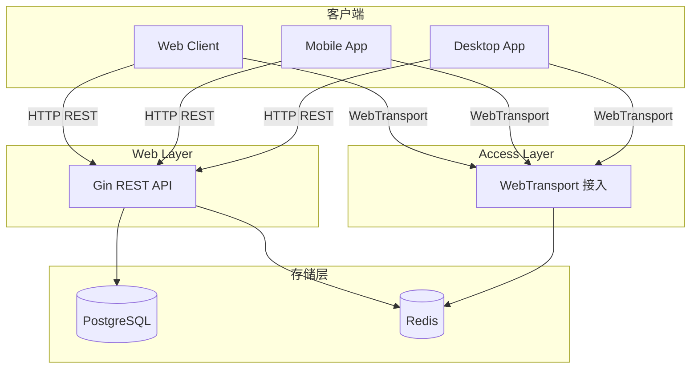

---

## 2. 整体架构

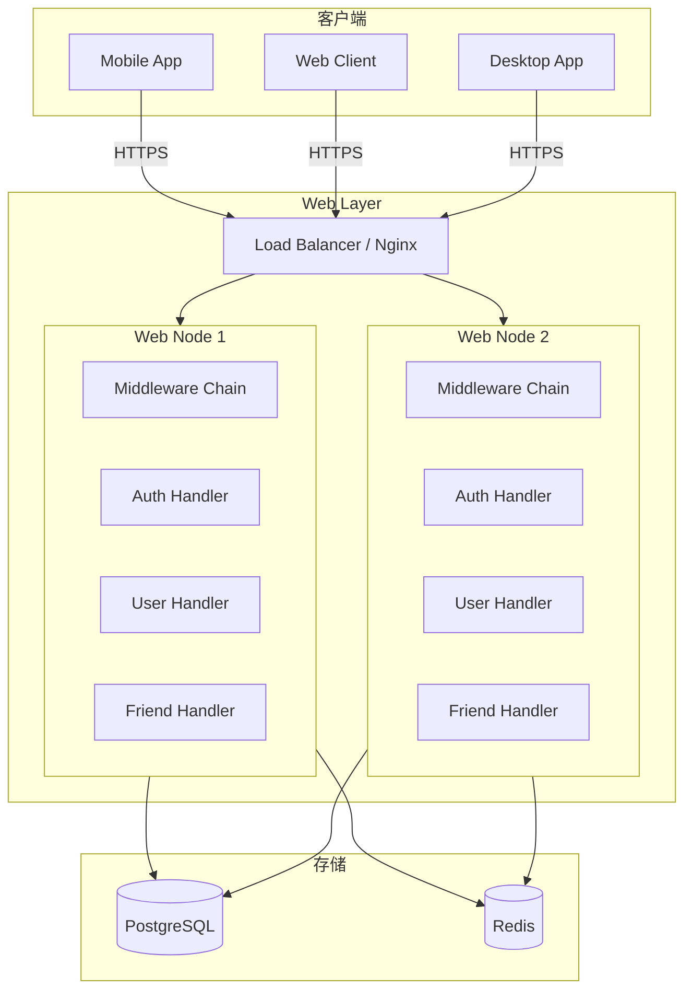

---

## 3. 模块设计

### 3.1 项目目录结构

```
web-go/
├── cmd/
│   └── web/
│       └── main.go              # 入口
├── internal/
│   ├── config/
│   │   └── config.go            # 配置加载
│   ├── handler/
│   │   ├── auth.go              # 认证接口
│   │   ├── user.go              # 用户接口
│   │   └── friend.go            # 好友接口
│   ├── middleware/
│   │   ├── auth.go              # JWT 认证中间件
│   │   ├── cors.go              # 跨域中间件
│   │   ├── logger.go            # 日志中间件
│   │   └── ratelimit.go         # 限流中间件
│   ├── model/
│   │   ├── user.go              # 用户模型
│   │   └── friend.go            # 好友模型
│   ├── repository/
│   │   ├── user.go              # 用户数据访问
│   │   └── friend.go            # 好友数据访问
│   ├── service/
│   │   ├── auth.go              # 认证服务
│   │   ├── user.go              # 用户服务
│   │   └── friend.go            # 好友服务
│   ├── router/
│   │   └── router.go            # 路由注册
│   └── jwt/
│       └── jwt.go               # JWT 工具
├── pkg/
│   ├── response/
│   │   └── response.go          # 统一响应
│   └── validator/
│       └── validator.go         # 参数校验
├── configs/
│   └── config.yaml
├── go.mod
└── go.sum
```

### 3.2 核心模块详解

#### 3.2.1 认证模块 (Auth Module)

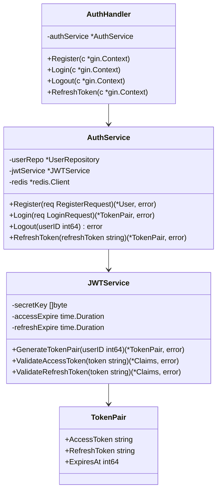

#### 3.2.2 用户模块 (User Module)

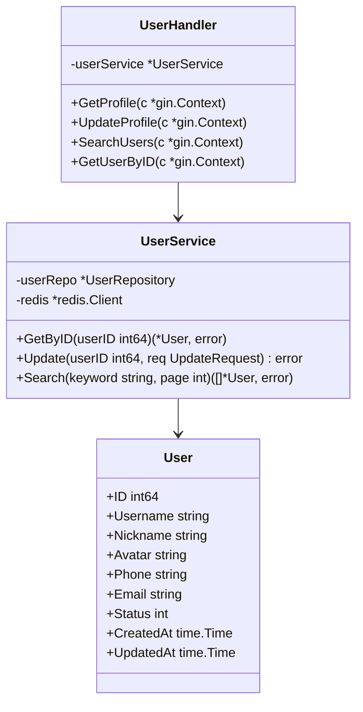

#### 3.2.3 好友模块 (Friend Module)

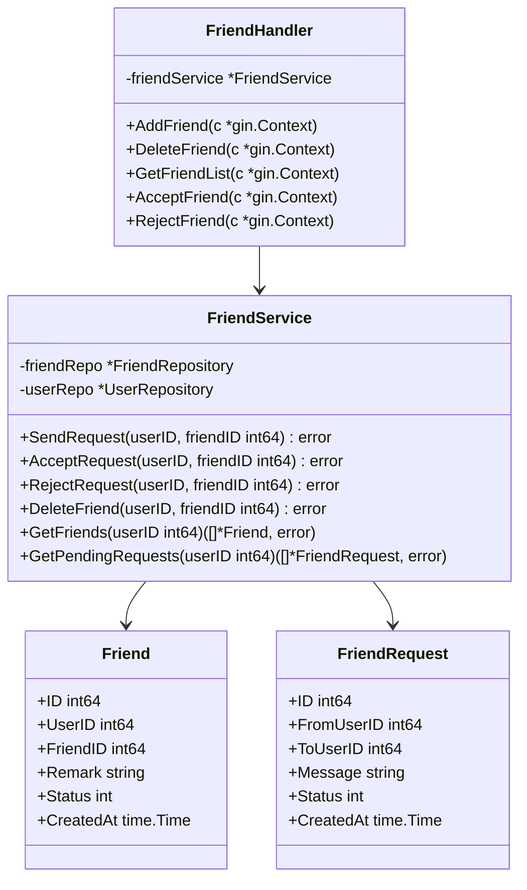

---

## 4. API 设计

### 4.1 API 列表

#### 认证相关

| 方法 | 路径 | 描述 | 认证 |
|------|------|------|------|
| POST | `/api/v1/auth/register` | 用户注册 | ❌ |
| POST | `/api/v1/auth/login` | 用户登录 | ❌ |
| POST | `/api/v1/auth/logout` | 用户登出 | ✅ |
| POST | `/api/v1/auth/refresh` | 刷新 Token | ❌ |

#### 用户相关

| 方法 | 路径 | 描述 | 认证 |
|------|------|------|------|
| GET | `/api/v1/user/profile` | 获取当前用户信息 | ✅ |
| PUT | `/api/v1/user/profile` | 更新用户信息 | ✅ |
| GET | `/api/v1/user/:id` | 获取指定用户信息 | ✅ |
| GET | `/api/v1/user/search` | 搜索用户 | ✅ |

#### 好友相关

| 方法 | 路径 | 描述 | 认证 |
|------|------|------|------|
| GET | `/api/v1/friends` | 获取好友列表 | ✅ |
| POST | `/api/v1/friends/request` | 发送好友请求 | ✅ |
| GET | `/api/v1/friends/requests` | 获取待处理请求 | ✅ |
| POST | `/api/v1/friends/accept/:id` | 接受好友请求 | ✅ |
| POST | `/api/v1/friends/reject/:id` | 拒绝好友请求 | ✅ |
| DELETE | `/api/v1/friends/:id` | 删除好友 | ✅ |

### 4.2 请求/响应格式

#### 统一响应格式

```json
{
    "code": 0,
    "message": "success",
    "data": {}
}
```

#### 错误响应格式

```json
{
    "code": 10001,
    "message": "用户名已存在",
    "data": null
}
```

### 4.3 API 详细定义

#### 用户注册

```http
POST /api/v1/auth/register
Content-Type: application/json

{
    "username": "john_doe",
    "password": "password123",
    "nickname": "John",
    "phone": "13800138000",
    "email": "john@example.com"
}
```

**响应：**

```json
{
    "code": 0,
    "message": "success",
    "data": {
        "user_id": 10001,
        "username": "john_doe",
        "nickname": "John"
    }
}
```

#### 用户登录

```http
POST /api/v1/auth/login
Content-Type: application/json

{
    "username": "john_doe",
    "password": "password123",
    "device_id": "xxx-xxx-xxx",
    "platform": "web"
}
```

**响应：**

```json
{
    "code": 0,
    "message": "success",
    "data": {
        "user_id": 10001,
        "access_token": "eyJhbGciOiJIUzI1NiIs...",
        "refresh_token": "eyJhbGciOiJIUzI1NiIs...",
        "expires_at": 1702800000
    }
}
```

#### 发送好友请求

```http
POST /api/v1/friends/request
Authorization: Bearer <access_token>
Content-Type: application/json

{
    "friend_id": 10002,
    "message": "你好，我是 John"
}
```

---

## 5. JWT 设计

### 5.1 Token 结构

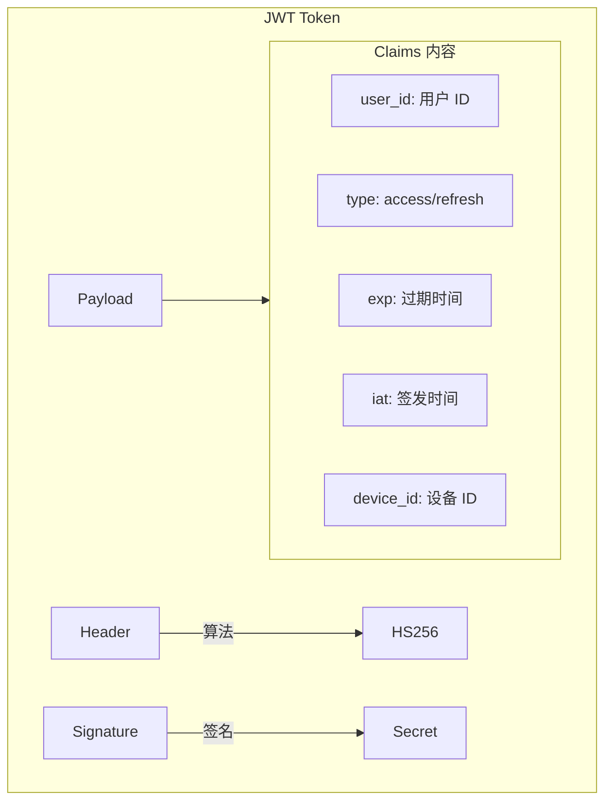

### 5.2 Token 策略

| Token 类型 | 有效期 | 用途 |
|------------|--------|------|
| Access Token | 7 天 | API 请求认证 |
| Refresh Token | 30 天 | 刷新 Access Token |

### 5.3 Token 刷新流程

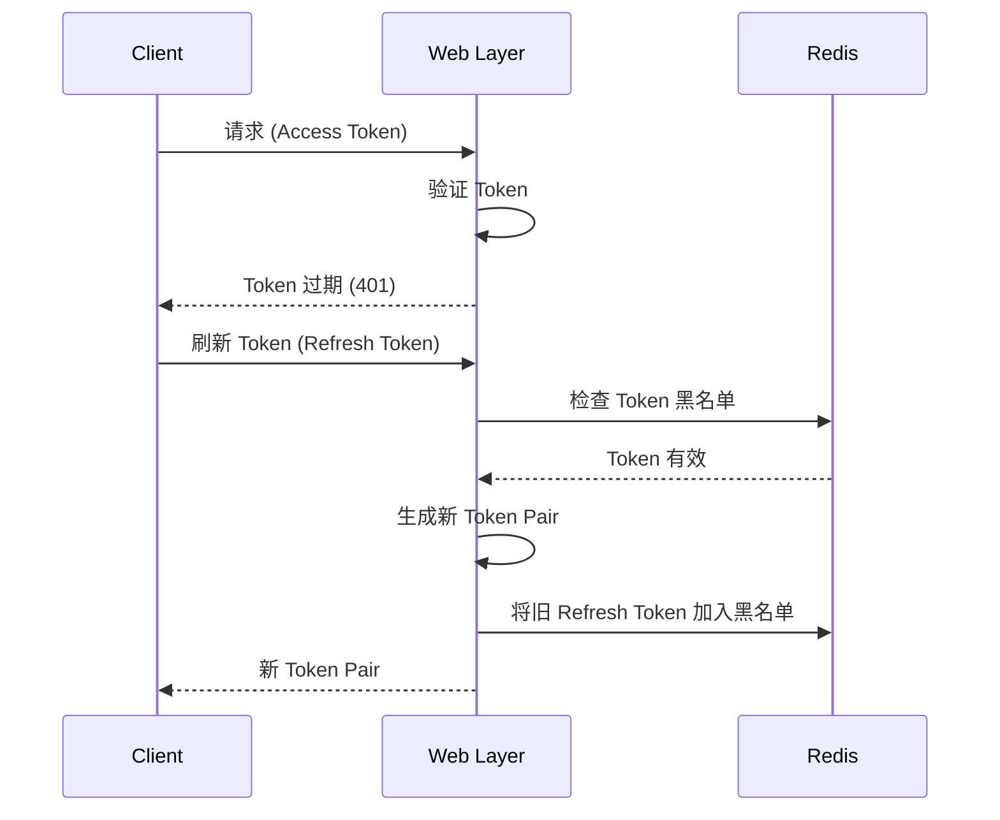

### 5.4 Token 黑名单

使用 Redis 存储已失效的 Token：

```
Key: im:token:blacklist:{token_hash}
Value: 1
TTL: Token 原过期时间
```

---

## 6. 数据库设计

### 6.1 ER 图

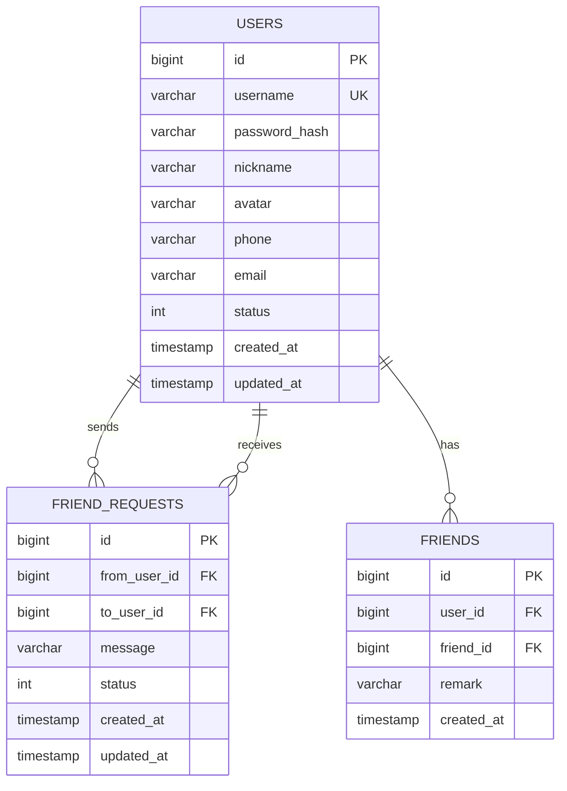

### 6.2 表结构

#### users 表

```sql
CREATE TABLE users (
    id BIGSERIAL PRIMARY KEY,
    username VARCHAR(50) UNIQUE NOT NULL,
    password_hash VARCHAR(255) NOT NULL,
    nickname VARCHAR(50) NOT NULL,
    avatar VARCHAR(255) DEFAULT '',
    phone VARCHAR(20) DEFAULT '',
    email VARCHAR(100) DEFAULT '',
    status SMALLINT DEFAULT 1,  -- 1: 正常, 0: 禁用
    created_at TIMESTAMP DEFAULT CURRENT_TIMESTAMP,
    updated_at TIMESTAMP DEFAULT CURRENT_TIMESTAMP
);

CREATE INDEX idx_users_phone ON users(phone);
CREATE INDEX idx_users_email ON users(email);
```

#### friend_requests 表

```sql
CREATE TABLE friend_requests (
    id BIGSERIAL PRIMARY KEY,
    from_user_id BIGINT NOT NULL REFERENCES users(id),
    to_user_id BIGINT NOT NULL REFERENCES users(id),
    message VARCHAR(200) DEFAULT '',
    status SMALLINT DEFAULT 0,  -- 0: 待处理, 1: 已接受, 2: 已拒绝
    created_at TIMESTAMP DEFAULT CURRENT_TIMESTAMP,
    updated_at TIMESTAMP DEFAULT CURRENT_TIMESTAMP
);

CREATE INDEX idx_friend_requests_to_user ON friend_requests(to_user_id, status);
CREATE UNIQUE INDEX idx_friend_requests_unique ON friend_requests(from_user_id, to_user_id)
    WHERE status = 0;
```

#### friends 表

```sql
CREATE TABLE friends (
    id BIGSERIAL PRIMARY KEY,
    user_id BIGINT NOT NULL REFERENCES users(id),
    friend_id BIGINT NOT NULL REFERENCES users(id),
    remark VARCHAR(50) DEFAULT '',
    created_at TIMESTAMP DEFAULT CURRENT_TIMESTAMP,
    UNIQUE(user_id, friend_id)
);

CREATE INDEX idx_friends_user ON friends(user_id);
```

---

## 7. 核心流程

### 7.1 注册流程

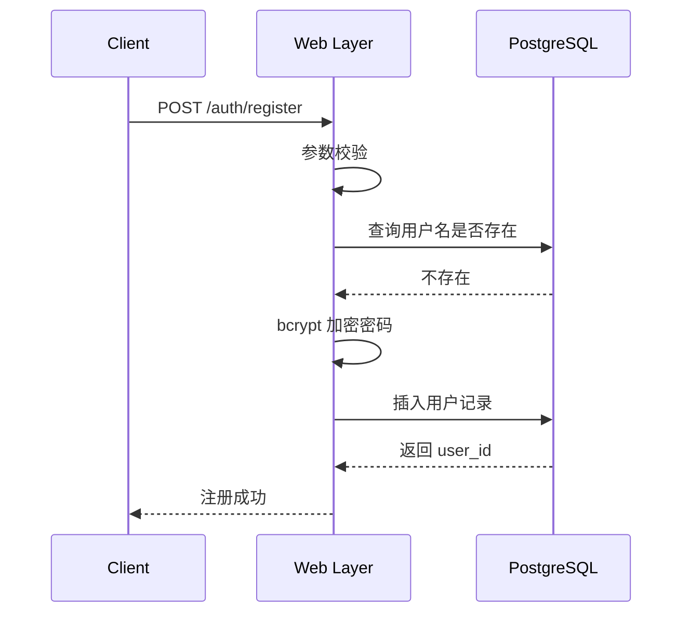

### 7.2 登录流程

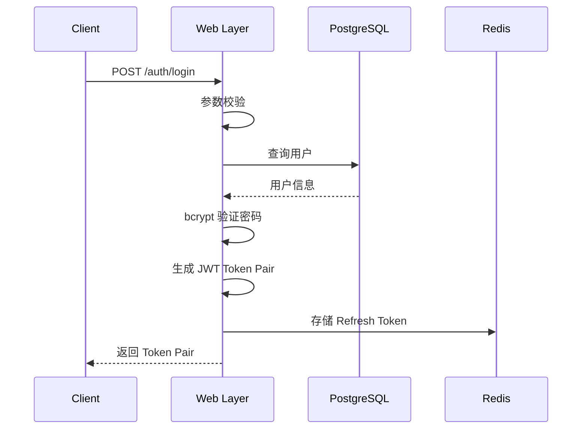

### 7.3 添加好友流程

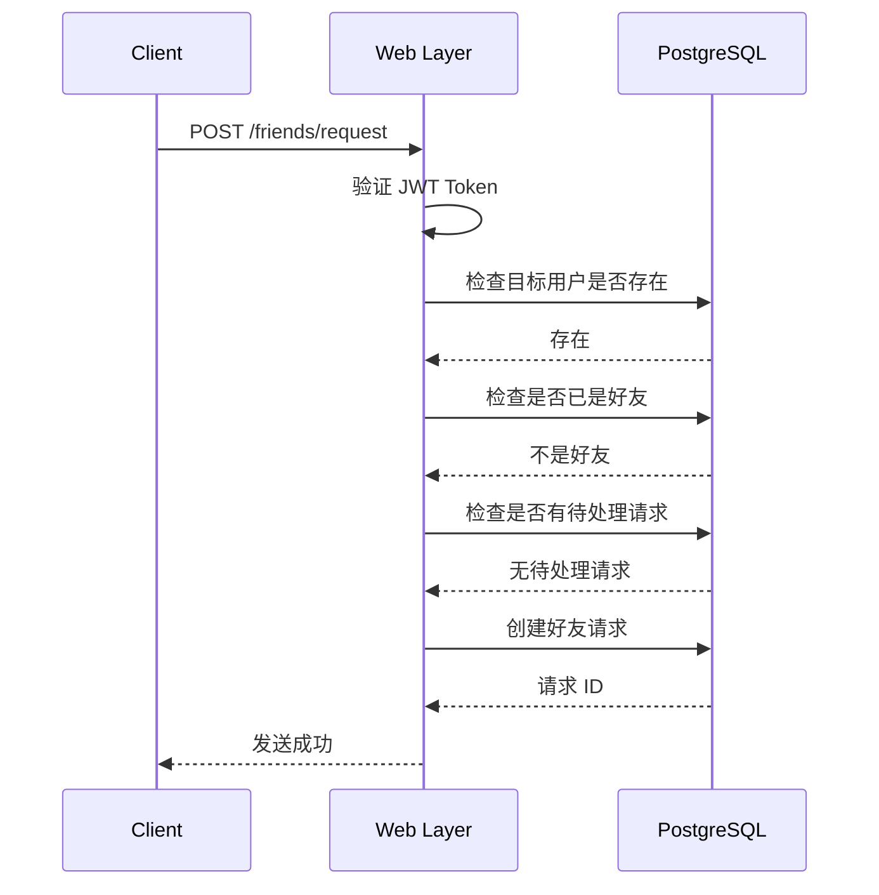

### 7.4 接受好友请求流程

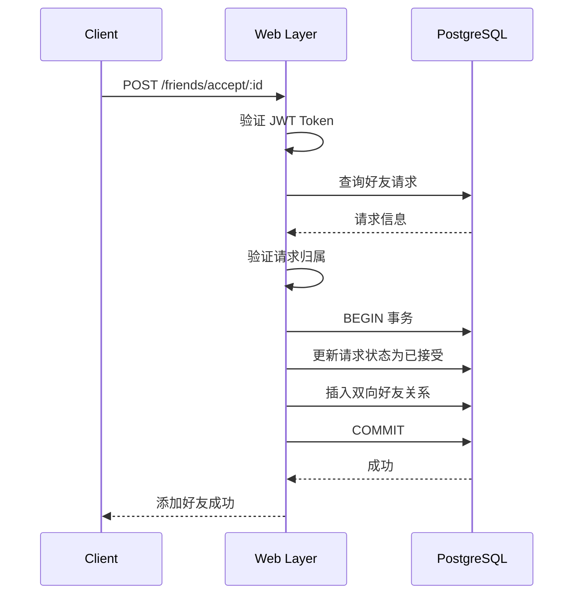

---

## 8. 中间件设计

### 8.1 中间件链

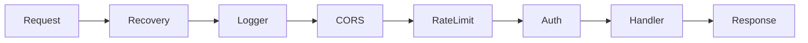

### 8.2 JWT 认证中间件

```go
func JWTAuth(jwtService *jwt.Service) gin.HandlerFunc {
    return func(c *gin.Context) {
        token := extractToken(c.GetHeader("Authorization"))
        if token == "" {
            c.AbortWithStatusJSON(401, response.Unauthorized())
            return
        }

        claims, err := jwtService.ValidateAccessToken(token)
        if err != nil {
            c.AbortWithStatusJSON(401, response.TokenInvalid())
            return
        }

        c.Set("user_id", claims.UserID)
        c.Set("device_id", claims.DeviceID)
        c.Next()
    }
}
```

### 8.3 限流中间件

```go
func RateLimit(rdb *redis.Client, limit int, window time.Duration) gin.HandlerFunc {
    return func(c *gin.Context) {
        key := fmt.Sprintf("rate_limit:%s", c.ClientIP())
        count, _ := rdb.Incr(c, key).Result()

        if count == 1 {
            rdb.Expire(c, key, window)
        }

        if count > int64(limit) {
            c.AbortWithStatusJSON(429, response.TooManyRequests())
            return
        }

        c.Next()
    }
}
```

---

## 9. 错误码设计

### 9.1 错误码范围

| 范围 | 模块 |
|------|------|
| 0 | 成功 |
| 10000-10999 | 认证相关 |
| 11000-11999 | 用户相关 |
| 12000-12999 | 好友相关 |
| 50000-50999 | 系统错误 |

### 9.2 错误码列表

| 错误码 | 描述 |
|--------|------|
| 0 | 成功 |
| 10001 | 用户名已存在 |
| 10002 | 用户名或密码错误 |
| 10003 | Token 无效 |
| 10004 | Token 已过期 |
| 10005 | 用户已被禁用 |
| 11001 | 用户不存在 |
| 11002 | 参数校验失败 |
| 12001 | 好友请求不存在 |
| 12002 | 已经是好友关系 |
| 12003 | 不能添加自己为好友 |
| 12004 | 好友请求待处理中 |
| 50001 | 服务器内部错误 |
| 50002 | 数据库错误 |

---

## 10. Redis 缓存设计

### 10.1 缓存 Key 设计

| Key 模式 | 用途 | TTL |
|----------|------|-----|
| `im:user:info:{user_id}` | 用户信息缓存 | 10 min |
| `im:user:token:{user_id}` | Refresh Token | 7 days |
| `im:token:blacklist:{hash}` | Token 黑名单 | Token 剩余有效期 |
| `im:rate_limit:{ip}` | IP 限流 | 1 min |
| `im:friends:{user_id}` | 好友列表缓存 | 5 min |

### 10.2 缓存策略

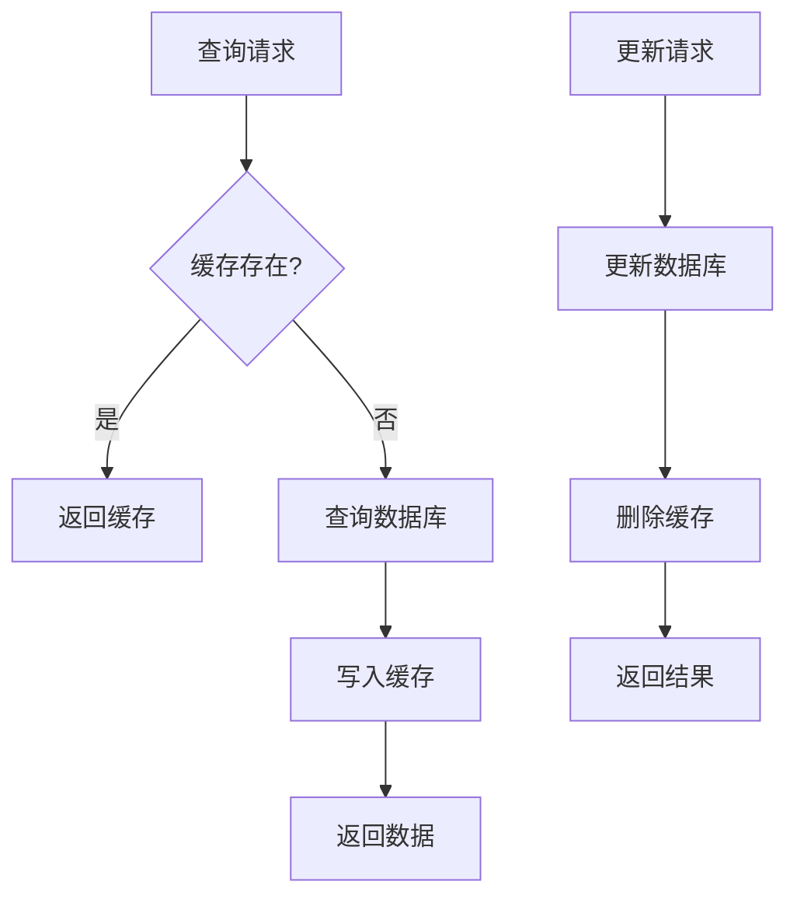

---

## 11. 安全设计

### 11.1 密码安全

- 使用 bcrypt 加密存储，cost = 10
- 密码强度校验：至少 8 位，包含字母和数字

### 11.2 API 安全

| 措施 | 描述 |
|------|------|
| HTTPS | 强制使用 HTTPS |
| JWT | Bearer Token 认证 |
| 限流 | 基于 IP 的请求限流 |
| CORS | 配置允许的域名 |
| 参数校验 | 使用 validator 校验 |

### 11.3 Token 安全

- Access Token 有效期 7 天
- Refresh Token 仅用于刷新
- 登出时将 Token 加入黑名单
- 敏感操作可要求重新登录

---

## 12. 部署架构

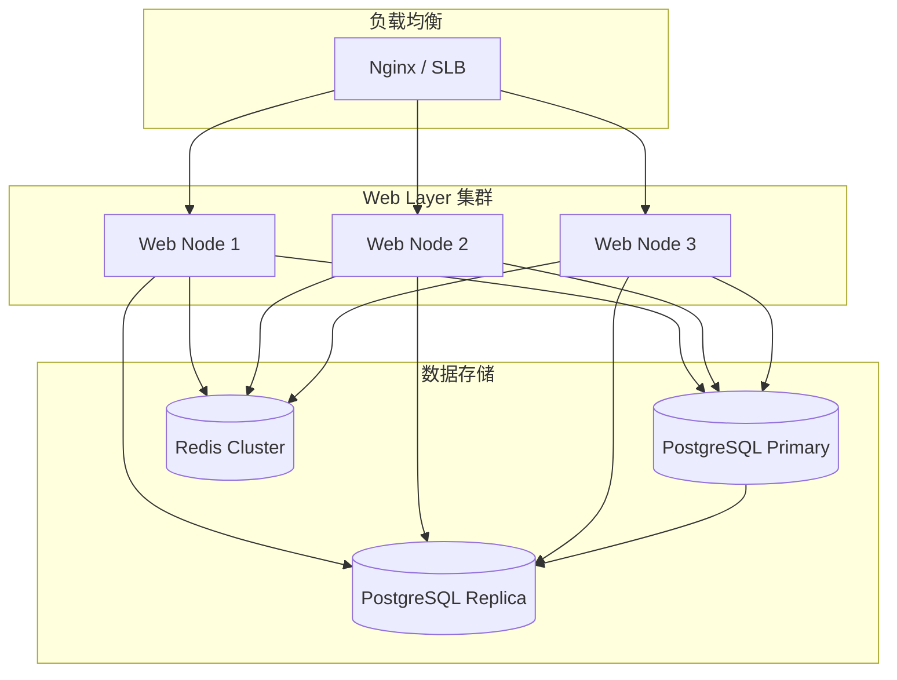

---

## 13. 监控指标

### 13.1 关键指标

| 指标 | 描述 |
|------|------|
| `web_http_requests_total` | HTTP 请求总数 |
| `web_http_request_duration` | 请求延迟分布 |
| `web_auth_login_total` | 登录次数 |
| `web_auth_login_failed` | 登录失败次数 |
| `web_db_query_duration` | 数据库查询耗时 |
| `web_redis_hit_rate` | Redis 命中率 |

### 13.2 Prometheus 集成

```go
// 后续集成 Prometheus
import "github.com/prometheus/client_golang/prometheus"

var httpRequestsTotal = prometheus.NewCounterVec(
    prometheus.CounterOpts{
        Name: "web_http_requests_total",
        Help: "Total number of HTTP requests",
    },
    []string{"method", "path", "status"},
)
```

---

## 14. 配置示例

```yaml
# configs/config.yaml
app:
  name: im-web
  port: 8080
  mode: debug  # debug, release, test

jwt:
  secret_key: "your-secret-key-here"
  access_expire: 168h   # 7 days
  refresh_expire: 720h  # 30 days

database:
  host: localhost
  port: 5432
  user: postgres
  password: postgres
  name: im_db
  max_open_conns: 100
  max_idle_conns: 10
  conn_max_lifetime: 1h

redis:
  host: localhost
  port: 6379
  password: ""
  db: 0
  pool_size: 100

cors:
  allowed_origins:
    - "http://localhost:3000"
    - "https://example.com"
  allowed_methods:
    - GET
    - POST
    - PUT
    - DELETE
  allow_credentials: true

rate_limit:
  enabled: true
  requests_per_minute: 60
```

---

## 15. 后续演进

- [ ] 实现基础注册登录功能
- [ ] 实现 JWT Token 签发与验证
- [ ] 实现用户查询功能
- [ ] 实现好友管理功能
- [ ] 集成 Prometheus 监控
- [ ] 添加 Swagger API 文档
- [ ] 实现更细粒度的权限控制
- [ ] 支持第三方登录 (OAuth2)
- [ ] 添加图形验证码
- [ ] 实现用户头像上传 (OSS)
